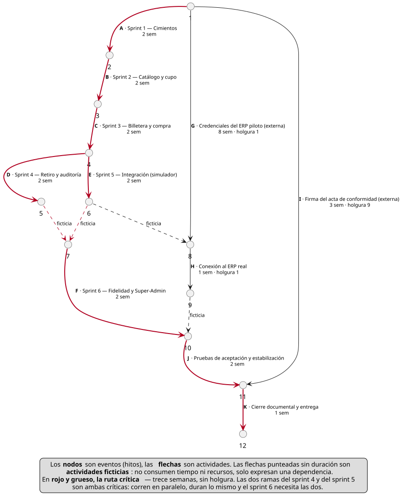

# Sprint backlogs y cronograma

La construcción se organiza en **seis sprints de dos semanas**. El backlog de cada uno se deriva de los requerimientos funcionales de este mismo documento: los diez módulos funcionan como épicas y cada `RF-nn` como ítem, con la prioridad MoSCoW ya asignada en su ficha.

---

## Organización de los sprints

El orden responde a las dependencias reales entre módulos: ninguno puede construirse antes que aquello sobre lo que se apoya.

| Sprint | Contenido | Depende de |
|---|---|---|
| 1 | Módulo A — autenticación, roles y control de acceso · esquema de base de datos | — |
| 2 | Módulo C — catálogo, menú e inventario reservado · armazón del panel del Proveedor | Sprint 1 |
| 3 | Módulo B — billetera y recarga · Módulo D — compra | Sprints 1 y 2 |
| 4 | Módulo E — retiro y entrega · Módulo J — auditoría | Sprint 3 |
| 5 | Módulo I — integración con ERP, contra el ERP simulado | Sprint 3 |
| 6 | Módulo F — cartilla de fidelidad · Módulo H — Super-Admin · resto del Módulo G | Sprints 4 y 5 |

: Organización de los sprints

**Por qué ese orden.** Todo el sistema necesita usuarios autenticados y tablas donde escribir, así que el módulo A y el esquema abren el trabajo. Sin menú publicado y cupo asignado no hay nada que comprar, de modo que el catálogo precede a la compra. El retiro cierra el ciclo del estudiante y solo tiene sentido con órdenes existentes. La integración con el ERP se construye contra el simulador (RF-52), lo que la independiza de la disponibilidad de credenciales externas. Fidelidad y Super-Admin quedan al final por ser los de menor prioridad MoSCoW.

Los sprints 4 y 5 **corren en paralelo**: ambos dependen del sprint 3 y ninguno del otro. Es la única bifurcación del plan, y existe porque la integración con el ERP no toca el flujo de retiro.

---

## Cómo se lee un backlog

Cada ítem se registra con estos campos:

| Campo | Contenido |
|---|---|
| Identificador | El `RF-nn` correspondiente, o `TT-nn` si es una tarea técnica sin requerimiento propio |
| Descripción | El enunciado del requerimiento |
| Criterio de aceptación | El que ya define su ficha en la sección 5 de este documento |
| Prioridad | MoSCoW, heredada del requerimiento |
| Responsable | Integrante asignado |
| Estimación | En puntos de historia |

: Campos de cada ítem del backlog

**El criterio de aceptación no se repite aquí.** Cada `RF-nn` ya lo trae en su ficha, y copiarlo a la tabla del sprint crearía dos versiones del mismo texto destinadas a divergir. El backlog referencia el identificador; la ficha manda.

**La escala de estimación** es Fibonacci —1, 2, 3, 5, 8— aplicada a tamaño relativo, no a horas. Un 8 es un ítem que nadie sabe estimar bien todavía y que conviene partir si crece más. Con tres integrantes y sprints de dos semanas, la velocidad supuesta es de **35 a 40 puntos por sprint**; es una suposición inicial que el primer sprint corrige.

**Los requerimientos no funcionales no forman un sprint propio.** Seguridad, rendimiento y auditoría se incorporan como criterios de aceptación de los ítems de cada sprint, porque verificarlos al final impide corregirlos a tiempo. El único que aparece como ítem es RF-54, que es la infraestructura de auditoría en sí.

**Tres requerimientos quedan fuera de los seis sprints.** `RF-12b` (transferir saldo entre establecimientos) está marcado *No en v1* en su propia ficha. `RF-11` (métodos de pago tokenizados) y `RF-53` (integrar un ERP sin API por vía alternativa) son *Podría* y quedan en un backlog no comprometido: el primero depende de qué pasarela se elija, y el segundo de que se confirme la vía de integración con Alpwin, que hoy no está confirmada. Comprometerlos sería planificar sobre algo que todavía no se sabe.

---

## Los seis backlogs

### Sprint 1 — Cimientos: autenticación, roles y esquema de datos

**Meta del sprint.** Cualquier persona de los cuatro roles entra al sistema, ve solo lo suyo, y existe una base de datos que impide por sí sola lo que las reglas de negocio prohíben.

| Ítem | Descripción | Prioridad | Responsable | Puntos |
|---|---|---|---|---|
| `TT-01` | Esquema de base de datos con sus restricciones declarativas | Debe | Antonio | 8 |
| `TT-02` | Armazón del proyecto, entornos e integración continua | Debe | Jesus | 5 |
| `RF-01` | Iniciar sesión con cuenta institucional | Debe | Jesus | 5 |
| `RF-02` | Crear perfil y tarjeta virtual en el primer ingreso | Debe | Antonio | 3 |
| `RF-03` | Iniciar sesión operativa con credenciales de rol | Debe | Yull | 5 |
| `RF-06` | Restringir cada rol a su ámbito de datos | Debe | Yull | 8 |
| `RF-04` | Gestionar las cuentas del propio local | Debería | Antonio | 3 |
| `RF-05` | Cerrar sesión y expirar sesiones inactivas | Debería | Yull | 2 |
| | | | **Total** | **39** |

: Backlog del sprint 1 — Cimientos

### Sprint 2 — Catálogo, menú y cupo reservado

**Meta del sprint.** El Proveedor publica su menú y aparta su cupo para Aliflow; el Estudiante elige local y ve qué hay disponible hoy. Todavía no se puede comprar.

| Ítem | Descripción | Prioridad | Responsable | Puntos |
|---|---|---|---|---|
| `RF-13` | Publicar y mantener el menú del local | Debe | Antonio | 5 |
| `RF-14` | Consultar el menú del día | Debe | Antonio | 3 |
| `RF-15` | Elegir establecimiento y mantener el contexto visible | Debe | Antonio | 5 |
| `RF-16` | Administrar el cupo reservado para Aliflow | Debe | Yull | 5 |
| `RF-39` | Configurar el horario máximo de retiro | Debe | Yull | 2 |
| `TT-03` | Armazón de navegación del panel del Proveedor | Debe | Jesus | 5 |
| `RF-17` | Alertar sobre cupo bajo o agotado | Debería | Yull | 3 |
| `RF-18` | Registrar las compras rechazadas por cupo agotado | Debería | Jesus | 3 |
| | | | **Total** | **31** |

: Backlog del sprint 2 — Catálogo, menú y cupo reservado

### Sprint 3 — Billetera y compra: el núcleo transaccional

**Meta del sprint.** El Estudiante recarga en un local y compra con ese saldo, sin que dos compras simultáneas puedan llevarse la misma última unidad ni el saldo de un local pagar en otro.

| Ítem | Descripción | Prioridad | Responsable | Puntos |
|---|---|---|---|---|
| `RF-07` | Consultar el saldo por establecimiento | Debe | Antonio | 3 |
| `RF-08` | Recargar saldo en un establecimiento | Debe | Jesus | 8 |
| `RF-09` | Registrar cada recarga con sus datos mínimos | Debe | Jesus | 3 |
| `RF-10` | Emitir comprobante interno de recarga | Debe | Antonio | 2 |
| `RF-12` | Impedir el gasto cruzado entre establecimientos | Debe | Yull | 3 |
| `RF-19` | Comprar un almuerzo | Debe | Yull | 8 |
| `RF-20` | Revalidar saldo y cupo inmediatamente antes de confirmar | Debe | Yull | 3 |
| `RF-21` | Impedir la sobreventa bajo concurrencia | Debe | Jesus | 8 |
| `RF-22` | Emitir comprobante interno de compra | Debe | Antonio | 2 |
| `RF-23` | Mostrar la confirmación con el horario máximo de retiro | Debe | Antonio | 2 |
| | | | **Total** | **42** |

: Backlog del sprint 3 — Billetera y compra

### Sprint 4 — Retiro, entrega y auditoría

**Meta del sprint.** El ciclo del Estudiante se cierra: el Operador valida el código, marca la entrega, y toda operación que mueve dinero o estado queda registrada.

| Ítem | Descripción | Prioridad | Responsable | Puntos |
|---|---|---|---|---|
| `RF-25` | Validar el código de retiro | Debe | Yull | 5 |
| `RF-26` | Confirmar la entrega | Debe | Yull | 3 |
| `RF-27` | Impedir la doble redención del código | Debe | Jesus | 5 |
| `RF-28` | Distinguir los tres casos de fallo de un código | Debe | Antonio | 3 |
| `RF-29` | Expirar automáticamente las órdenes no retiradas | Debe | Jesus | 3 |
| `RF-41` | Consultar el detalle de una venta para re-emitir la factura | Debe | Antonio | 3 |
| `RF-54` | Registrar en auditoría las operaciones sensibles | Debe | Jesus | 5 |
| `RF-56` | Conservar el histórico sin borrado | Debe | Antonio | 2 |
| `RF-24` | Consultar el historial de órdenes | Debería | Antonio | 3 |
| `RF-30` | Buscar una orden sin código | Debería | Yull | 3 |
| `RF-31` | Limitar los intentos fallidos de validación | Debería | Jesus | 3 |
| `RF-55` | Registrar los intentos de validación fallidos | Debería | Yull | 2 |
| | | | **Total** | **40** |

: Backlog del sprint 4 — Retiro, entrega y auditoría

### Sprint 5 — Integración con el ERP, contra el simulador

**Meta del sprint.** Una venta confirmada llega al ERP del local sin intervención humana y sin perderse si el ERP está caído. Todo se demuestra contra un ERP simulado, sin depender de credenciales de terceros.

| Ítem | Descripción | Prioridad | Responsable | Puntos |
|---|---|---|---|---|
| `RF-47` | Exponer una interfaz única de integración | Debe | Jesus | 5 |
| `RF-48` | Seleccionar el adaptador según el local | Debe | Jesus | 3 |
| `RF-49` | Notificar cada venta al ERP mediante cola de eventos | Debe | Jesus | 8 |
| `RF-52` | Operar contra un ERP simulado | Debe | Yull | 5 |
| `RF-42` | Configurar la integración con el ERP del local | Debe | Antonio | 5 |
| `RF-50` | Notificar los pagos al ERP | Debería | Jesus | 3 |
| `RF-51` | Sincronizar el catálogo desde el ERP por consulta periódica | Debería | Yull | 5 |
| `RF-40` | Consultar el estado de sincronización con el ERP | Debería | Antonio | 3 |
| | | | **Total** | **37** |

: Backlog del sprint 5 — Integración con el ERP, contra el simulador

### Sprint 6 — Fidelidad, Super-Admin y cierre del alcance

**Meta del sprint.** El local puede premiar la recurrencia y Aliflow puede dar de alta locales nuevos y ver el estado de todos. Es el sprint que se recorta primero si hay que recortar.

| Ítem | Descripción | Prioridad | Responsable | Puntos |
|---|---|---|---|---|
| `RF-43` | Dar de alta un local | Debe | Antonio | 5 |
| `RF-32` | Configurar el programa de fidelidad del local | Debería | Yull | 3 |
| `RF-33` | Acreditar el sello al confirmar la entrega | Debería | Yull | 3 |
| `RF-34` | Consultar la cartilla | Debería | Antonio | 3 |
| `RF-38` | Consultar métricas del local | Debería | Antonio | 5 |
| `RF-44` | Activar y desactivar locales | Debería | Antonio | 2 |
| `RF-45` | Brindar soporte con visibilidad transversal | Debería | Jesus | 5 |
| `RF-46` | Monitorear el estado de todas las integraciones | Debería | Jesus | 3 |
| `RF-35` | Canjear el premio como descuento del 100% | Podría | Yull | 5 |
| `RF-36` | Expirar cartillas vencidas | Podría | Yull | 2 |
| `RF-37` | Representar el canje en el ERP del local | Podría | Jesus | 3 |
| | | | **Total** | **39** |

: Backlog del sprint 6 — Fidelidad, Super-Admin y cierre del alcance

---

## Carga y reparto

| Sprint | Ítems | Puntos | Jesus | Yull | Antonio |
|---|---|---|---|---|---|
| 1 — Cimientos | 8 | 39 | 10 | 15 | 14 |
| 2 — Catálogo y cupo | 8 | 31 | 8 | 10 | 13 |
| 3 — Billetera y compra | 10 | 42 | 19 | 14 | 9 |
| 4 — Retiro y auditoría | 12 | 40 | 16 | 13 | 11 |
| 5 — Integración con ERP | 8 | 37 | 19 | 10 | 8 |
| 6 — Fidelidad y Super-Admin | 11 | 39 | 11 | 13 | 15 |
| **Total** | **57** | **228** | **83** | **75** | **70** |

: Puntos por sprint y por integrante

Los 57 ítems comprometidos son **54 requerimientos funcionales más las tres tareas técnicas**. Que el número coincida con los 57 requerimientos de la sección 5 es casualidad: no son el mismo conjunto, porque tres requerimientos quedaron fuera y tres tareas técnicas entraron.

**El sprint 3 es el pico, y es deliberado que se vea.** Concentra el núcleo transaccional —recarga, compra, concurrencia— y es el único sprint donde un fallo de diseño obliga a rehacer trabajo posterior. Aplanar el número moviendo ítems a otros sprints no habría reducido el riesgo, solo lo habría escondido. La respuesta es al revés: el sprint 3 no lleva ningún ítem *Podría*, de modo que todo lo que contiene es irrenunciable y no compite con nada opcional.

**El reparto por persona no es parejo dentro de cada sprint, y no debería serlo.** Cada integrante concentra los ítems de su especialidad, y esa especialidad no se reparte uniforme en el tiempo: la integración con el ERP se acumula en el sprint 5, las pantallas en el 2 y el 6. Lo que sí queda parejo es el total del proyecto —83, 75 y 70 puntos—, y esa es la cifra que corresponde equilibrar.

**Dónde se recorta si hay que recortar.** El sprint 6 es el candidato: sus once ítems son *Debería* y *Podría* salvo RF-43. Recortarlo entero deja un producto que vende, cobra y entrega, sin cartilla de fidelidad y con el alta de locales hecha a mano. Ningún otro sprint admite ese trato.

---

## Cronograma

El cronograma se representa con un diagrama **activity-on-arrow**: las flechas son las actividades y los nodos son eventos o hitos. Es la representación que hace visible la **ruta crítica** —la cadena de actividades sin holgura, la que fija la duración del proyecto— y el aporte de las actividades que no dependen del equipo.

### Las actividades

| | Actividad | Duración | Predecesoras |
|---|---|---|---|
| **A** | Sprint 1 — Cimientos | 2 sem | — |
| **B** | Sprint 2 — Catálogo y cupo | 2 sem | A |
| **C** | Sprint 3 — Billetera y compra | 2 sem | B |
| **D** | Sprint 4 — Retiro y auditoría | 2 sem | C |
| **E** | Sprint 5 — Integración contra el simulador | 2 sem | C |
| **F** | Sprint 6 — Fidelidad y Super-Admin | 2 sem | D, E |
| **G** | Gestión de credenciales del ERP piloto *(externa)* | 8 sem | — |
| **H** | Conexión y prueba contra el ERP real | 1 sem | E, G |
| **I** | Firma del acta de conformidad *(externa)* | 3 sem | — |
| **J** | Pruebas de aceptación y estabilización | 2 sem | F, H |
| **K** | Cierre documental y entrega | 1 sem | J, I |

: Actividades del proyecto, con su duración y sus precedencias

Las actividades **G** e **I** arrancan el primer día aunque no produzcan nada hasta el final: no dependen del equipo y su duración la fija un tercero, así que empezarlas tarde es la forma más barata de perder el proyecto.

### La red y la ruta crítica

Los eventos numerados del diagrama son estos hitos:

| Nodo | Hito |
|---|---|
| 1 | Inicio del proyecto |
| 2 | Cimientos listos: los cuatro roles entran y cada uno ve solo lo suyo |
| 3 | Catálogo y cupo operativos |
| 4 | Núcleo transaccional cerrado: se recarga y se compra |
| 5 | Ciclo de retiro y auditoría cerrado |
| 6 | Integración lista y demostrada contra el ERP simulado |
| 7 | Listo para arrancar el sprint 6 |
| 8 | Listo para conectar el ERP real: hay integración y hay credenciales |
| 9 | ERP real conectado y probado |
| 10 | Alcance de v1 completo |
| 11 | Sistema estabilizado y acta firmada |
| 12 | Entrega |

: Hitos del cronograma

Aplicando el método del camino crítico sobre esa red:

| Actividad | Inicio temprano | Fin temprano | Inicio tardío | Fin tardío | Holgura |
|---|---|---|---|---|---|
| **A** | 0 | 2 | 0 | 2 | **0 — crítica** |
| **B** | 2 | 4 | 2 | 4 | **0 — crítica** |
| **C** | 4 | 6 | 4 | 6 | **0 — crítica** |
| **D** | 6 | 8 | 6 | 8 | **0 — crítica** |
| **E** | 6 | 8 | 6 | 8 | **0 — crítica** |
| **F** | 8 | 10 | 8 | 10 | **0 — crítica** |
| **G** | 0 | 8 | 1 | 9 | 1 sem |
| **H** | 8 | 9 | 9 | 10 | 1 sem |
| **I** | 0 | 3 | 9 | 12 | 9 sem |
| **J** | 10 | 12 | 10 | 12 | **0 — crítica** |
| **K** | 12 | 13 | 12 | 13 | **0 — crítica** |

: Cálculo de holguras (semanas desde el inicio del proyecto)

**La ruta crítica dura trece semanas** y es A → B → C → {D, E} → F → J → K. Tiene dos ramas paralelas y ambas son críticas: los sprints 4 y 5 duran lo mismo y el sprint 6 necesita los dos, así que un día de retraso en cualquiera de ellos es un día de retraso en la entrega. No hay ninguna rama de la que sacar gente sin costo.

**Lo que el cálculo deja ver, y es el motivo de hacerlo:**

- **Las credenciales del ERP tienen una semana de holgura, no cero pero casi.** Es el riesgo R-01, el único de impacto catastrófico del proyecto, y el cronograma confirma que llega justo. Si el trámite se pasa una semana, empuja la entrega día por día.
- **RF-52 es lo que evita que ese riesgo sea peor.** Construir contra un ERP simulado saca la actividad **E** de la dependencia de **G**: sin ese requerimiento, el sprint 5 entero no podría empezar hasta tener credenciales, la ruta crítica pasaría por **G** y el proyecto duraría dieciséis semanas en vez de trece, con la fecha de entrega en manos de un tercero. Un requerimiento de prioridad *Debe* que existe para comprar independencia, no funcionalidad.
- **El acta de conformidad tiene nueve semanas de holgura.** Es el trámite externo cómodo, y por eso no vale la pena apurarlo a costa de otra cosa. Pero su holgura desaparece si se empieza tarde: el margen es del calendario, no del trámite.

### El calendario

Sobre un inicio el 17 de agosto de 2026, la construcción termina el 15 de noviembre. Las barras grises son las dos actividades que no dependen del equipo.

---

## Insumos

| Insumo | De dónde sale |
|---|---|
| Ítems del backlog, ya priorizados | Sección 5 — requerimientos funcionales |
| Criterios de aceptación | Ídem, ficha de cada requerimiento |
| Holguras y planes de contingencia | Sección 6 — gestión de riesgos |
| Orden de los sprints de integración | Ruta de implementación por fases del análisis de integración |
| Reparto por integrante | Tabla de responsabilidades de la portada |

: Insumos para el backlog y el cronograma
