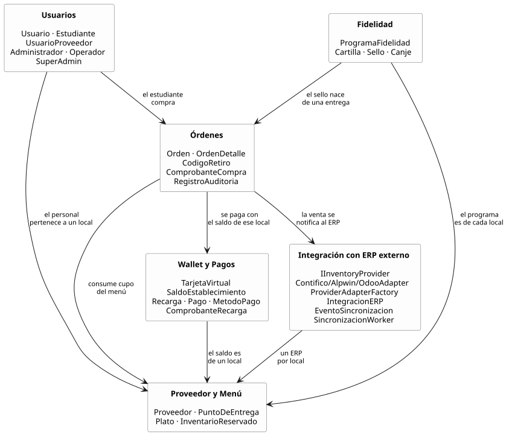
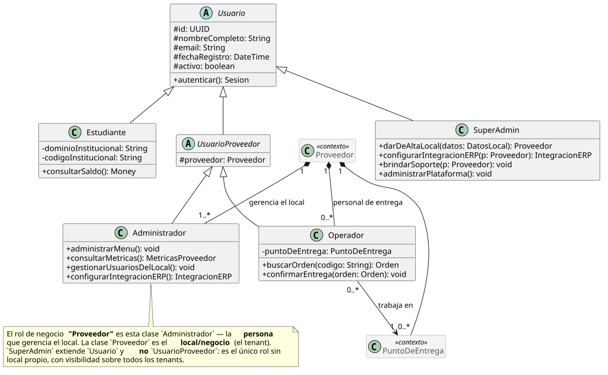
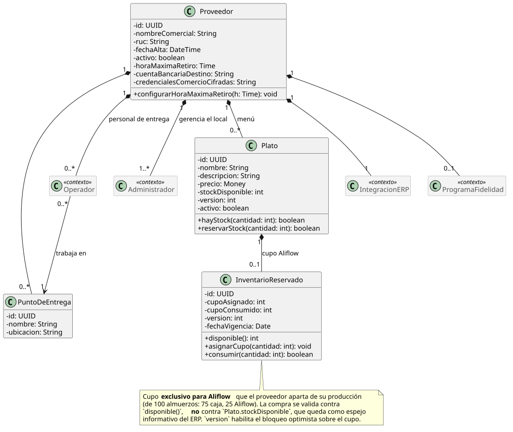
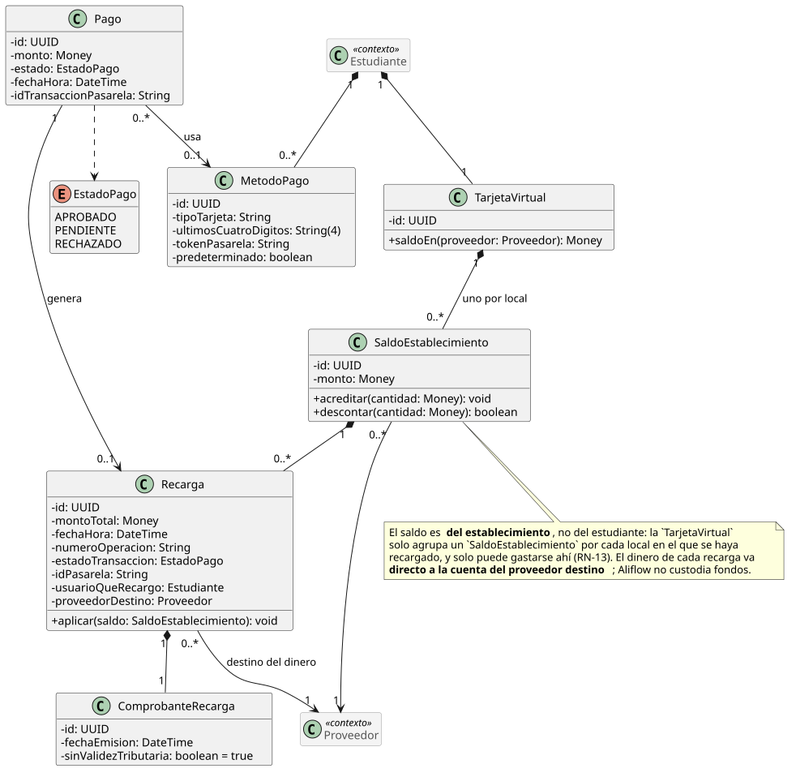
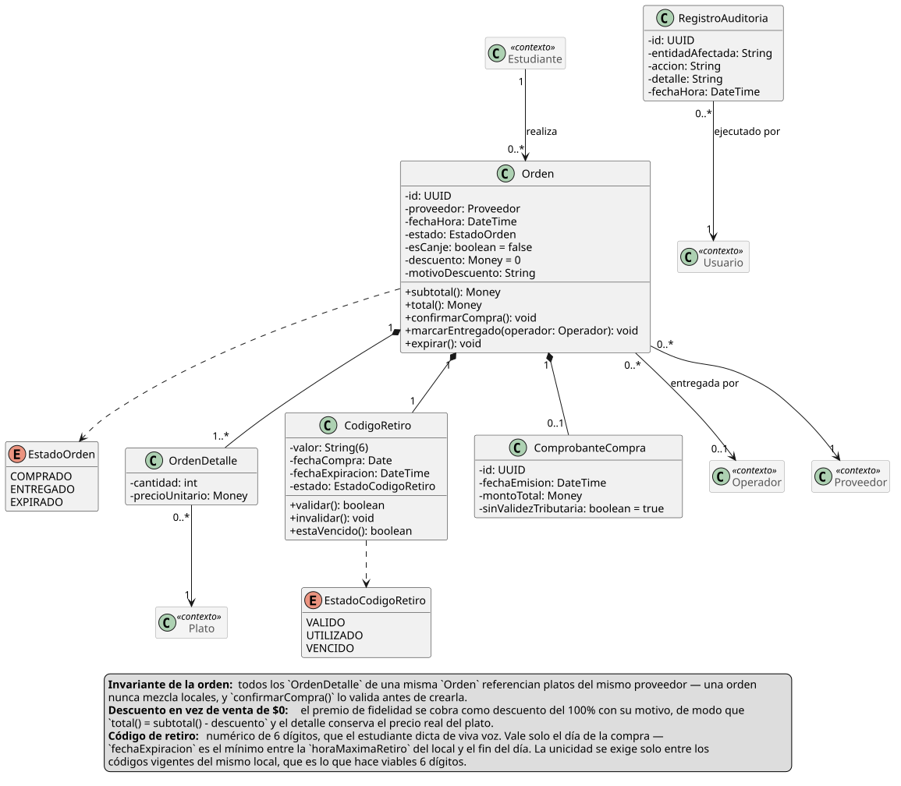
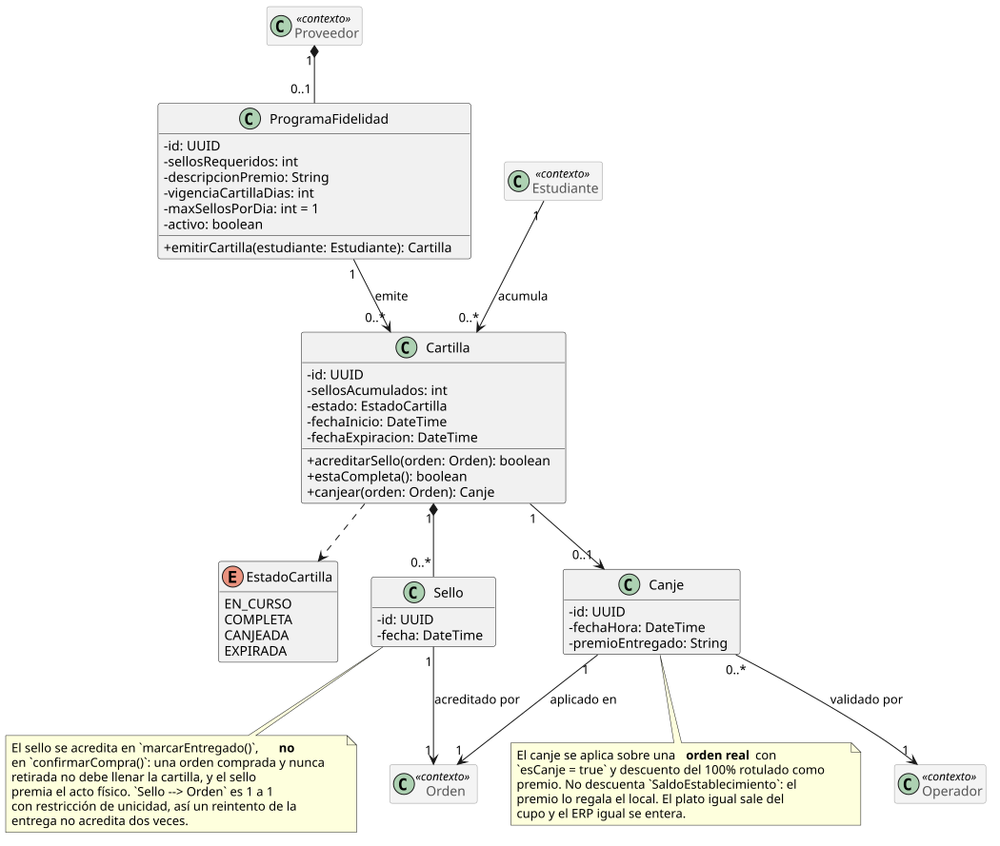
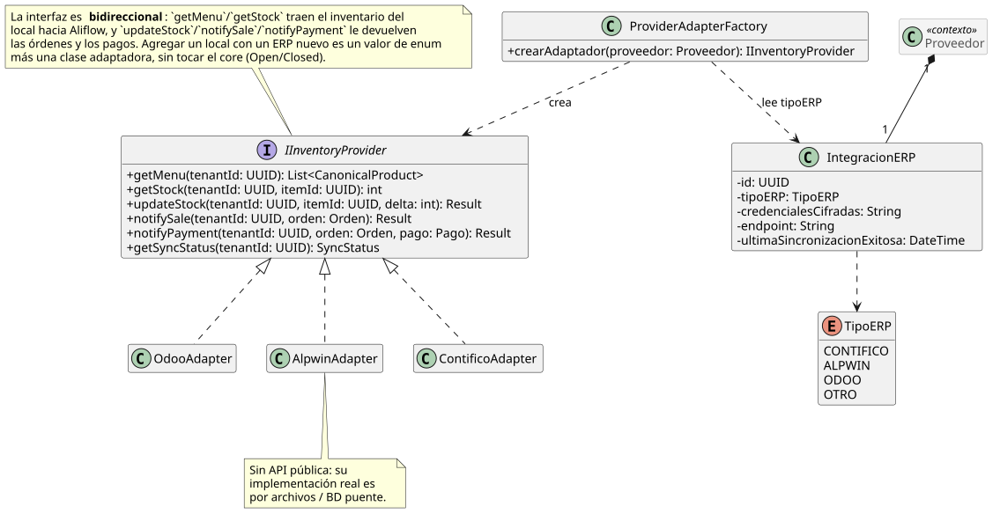
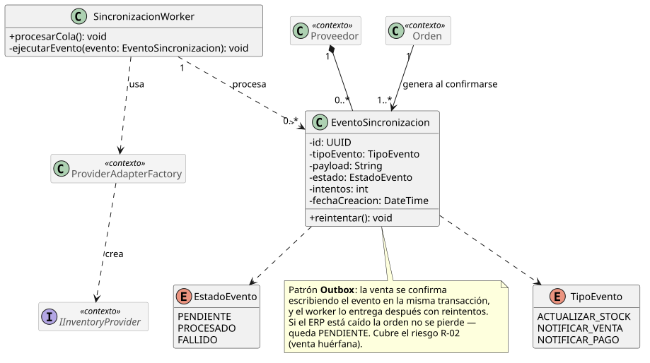

# Documentación del Diagrama de Clases — Aliflow

Este diagrama modela la **lógica de negocio** del sistema (no las clases de infraestructura/ORM/framework), organizada en seis paquetes.

El modelo se presenta en **una vista por paquete** en lugar de una sola lámina. Con cuarenta clases, sus atributos y sus operaciones, un único diagrama ajustado al ancho de la página deja el texto en menos de medio milímetro de alto: existe, pero no se puede leer. La vista general de abajo cumple el papel de mapa —qué paquetes hay y cómo dependen entre sí— y cada paquete se desarrolla después con todo su detalle.

**Cómo leer las vistas de detalle.** Cada una muestra completas las clases de su paquete y, en **gris y con el estereotipo «contexto»**, las clases de otros paquetes con las que se relaciona. Una clase gris siempre aparece completa en la vista de su propio paquete; se la dibuja aquí solo para que la asociación no quede colgando.

## 1. Paquete "Usuarios"

Jerarquía de herencia con **`Usuario`** como clase abstracta base (id, nombreCompleto, email, fechaRegistro, activo), especializada en:

- **`Estudiante`** — mapea al actor "Estudiante".
- **`UsuarioProveedor`** (abstracta) — una persona con acceso al panel de un local específico (`# proveedor: Proveedor`). Se especializa en **`Administrador`**, que mapea al actor **"Proveedor"** (administra menú, métricas, la integración con el ERP del local y las cuentas del personal de su propio local, UC12), y en **`Operador`**, que valida las compras y marca la entrega física, asociado a un `PuntoDeEntrega` específico.
- **`SuperAdmin`** — extiende `Usuario` directamente, **no** `UsuarioProveedor`. La distinción es deliberada: `UsuarioProveedor` obliga a pertenecer a un local, y el Super-Admin es el único rol **sin** local, con visibilidad sobre todos los tenants. Da de alta locales nuevos, les crea su vista de proveedor, configura su integración con el ERP y brinda soporte.

**Nota de vocabulario (importante para no perderse en el diagrama):** la palabra "Proveedor" designa dos cosas distintas.

| En el lenguaje del cliente | En el diagrama de clases | Qué es |
|---|---|---|
| Rol **"Proveedor"** (= "Administrador", el gerente) | clase `Administrador` | una **persona** con cuenta en Aliflow |
| El **local** / proveedor de alimentación (Barú, Caramel Coffee) | clase `Proveedor` | el **negocio**: el tenant, con su menú, su ERP y su personal |

: Los dos sentidos de la palabra "Proveedor"

Se conservó `Proveedor` como nombre de la entidad-negocio porque así se usa en el acta ("proveedores de alimentación") y en todo el resto del modelo (`SaldoEstablecimiento`, `IntegracionERP`, `tenantId`). Renombrarla habría propagado cambios a una decena de archivos sin ganar claridad real; la tabla de arriba y una nota dentro del propio diagrama resuelven la ambigüedad.

Un local puede tener **varias** cuentas de Proveedor y varias de Operador, de ahí las cardinalidades `Proveedor "1" *-- "1..*" Administrador` (al menos un gerente) y `Proveedor "1" *-- "0..*" Operador`.

## 2. Paquete "Proveedor y Menú"

**`Proveedor`** (el tenant/negocio — en la práctica, cada local de comida de la universidad) agrega su personal, sus puntos de entrega físicos y su menú (`Plato`). `Plato.hayStock` encapsula la validación de disponibilidad que en el flujo se menciona como "revalidación de stock justo antes de confirmar" (`est-4`).

**Control de concurrencia.** `Plato` tiene un campo `version` y un método `reservarStock(cantidad)` que implementan bloqueo optimista para el riesgo identificado desde el flujo original: dos estudiantes no deben poder comprar la última unidad simultáneamente. El detalle exacto de la transacción se completa en el diagrama de secuencia.

**Validado empíricamente** (ver `../../../demo-odoo/README.md` sección 7): se probó implementar este mismo bloqueo directamente contra el ERP externo (Odoo, vía RPC) y falló bajo concurrencia real — cinco hilos comprando con tres unidades de stock vendieron cinco. Esto confirma que `Plato.version`/`reservarStock` deben vivir en la base de datos propia de Aliflow y no delegarse al ERP; la misma prueba contra un dominio local con lock real (`../../../demo-odoo/plato_local.py`) sí se comportó correctamente.

### La clase `InventarioReservado`

Es la clase que cambia cómo se decide si Aliflow puede vender.

**El problema que resuelve.** El ERP del local descuenta al instante cuando alguien compra en caja, pero Aliflow puede tardar en enterarse. En esa ventana, un estudiante compra algo que ya no existe. Son **dos escritores sobre el mismo contador** sin transacción común: sincronizar más seguido achica la ventana, no la cierra.

**Cómo lo resuelve.** El proveedor aparta un cupo exclusivo para Aliflow (de 100 almuerzos: 75 a caja, 25 a Aliflow) y lo administra desde su panel (UC16). **Aliflow valida la compra contra `InventarioReservado.disponible()`, no contra `Plato.stockDisponible`.**

**Por qué es la solución correcta y no un parche:** convierte un problema de consistencia distribuida —difícil, y sin solución completa cuando no se controlan los dos sistemas— en uno de **partición de recursos**, que es trivial. Aliflow deja de competir por un dato compartido porque pasa a ser dueño exclusivo del suyo.

`Plato.stockDisponible` no desaparece: queda como **espejo informativo** del ERP, útil para conciliar y para que el proveedor decida cuánto asignar. `InventarioReservado` conserva su propio `version` para el bloqueo optimista, porque dos estudiantes sí pueden pelear por la última unidad **del cupo**.

**Costo que introduce, registrado como riesgo R-20:** el cupo depende de que el proveedor lo mantenga al día. Si no lo repone, Aliflow muestra "agotado" mientras el local tiene comida — y el fallo es silencioso, porque nadie reclama por lo que no puede comprar.

## 3. Paquete "Wallet y Pagos"

**El saldo pertenece al establecimiento, no al estudiante.** El estudiante recarga *para un local* y solo puede gastar ahí. El dinero va de la pasarela **directo a la cuenta de ese proveedor**; Aliflow no lo recibe ni lo custodia en ningún momento.

`TarjetaVirtual` es el contenedor que agrupa un `SaldoEstablecimiento` por cada local en el que el estudiante haya recargado. `SaldoEstablecimiento` es el saldo real en ese local: una compra en un establecimiento nunca puede consumir el saldo de otro, y no existe transferencia entre ellos.

`Recarga` lleva el establecimiento destino como dato obligatorio, y `Proveedor` guarda su cuenta bancaria y sus credenciales de comercio, porque cada local recibe directamente el dinero de sus recargas. Cada recarga registra además valor, fecha y hora, número de operación, estado de la transacción e identificador de la pasarela, y queda en histórico para auditoría y conciliación.

`Pago` (con `EstadoPago`: APROBADO/PENDIENTE/RECHAZADO) genera una `Recarga` solo si es aprobado. `ComprobanteRecarga` es el comprobante interno **sin validez tributaria**: recargar todavía no es comprar un alimento, y la factura la emite el ERP del local recién en la compra. `MetodoPago` guarda únicamente tipo de tarjeta, últimos cuatro dígitos y el token de la pasarela: Aliflow nunca almacena el número completo ni el código de seguridad.

**Se eliminó el patrón Strategy `EstrategiaDistribucionRecarga`.** Existía para encapsular *cómo* Aliflow repartía internamente una recarga única entre los locales. Con la recarga por establecimiento ya no hay reparto que hacer: el dinero llega directo a un único destinatario conocido desde el principio. Se retira en vez de conservarse porque un patrón sin un problema que resolver es sobre-ingeniería.

## 4. Paquete "Órdenes"

**`Orden`** agrega uno o más `OrdenDetalle` (plato + cantidad + precio unitario) y tiene un `CodigoRetiro` propio. `ComprobanteCompra` es el comprobante interno sin validez tributaria (`est-4`/`prov-6`), distinto de la factura real que el proveedor emite en su propio ERP.

`EstadoOrden` incluye **`EXPIRADO`** además de `COMPRADO`/`ENTREGADO`, para cubrir el vacío de "orden nunca retirada": la orden expira al terminar el día de la compra. Lo único que sigue abierto es la política de reembolso del dinero de una orden expirada, y el hecho de que Aliflow nunca custodia fondos acota mucho las salidas posibles.

**Formato del código.** Es un **código numérico corto de seis dígitos**, no un UUID firmado. La razón es operativa: el estudiante se lo dice de viva voz al Operador, que lo digita para marcar el retiro — un UUID de 36 caracteres es impracticable para eso. Trae dos consecuencias de diseño:

1. **La unicidad se acota.** Seis dígitos son ~10⁶ combinaciones: suficientes solo si la unicidad se exige entre los códigos **vigentes de un mismo local**, no globalmente ni de forma histórica. La generación reintenta ante colisión. Que el código valga un solo día es lo que mantiene ese universo pequeño.
2. **El código pasa a ser adivinable.** Un UUID firmado no se puede adivinar; seis dígitos sí. Registrado como riesgo **R-15** en `../01-Especificacion-de-Requerimientos/06-Gestion-de-Riesgos.md`, con su mitigación: límite de intentos, y el hecho de que el Operador ve físicamente al estudiante.

**Regla de un solo local por orden.** `Orden` tiene una asociación directa a `Proveedor` (no solo indirecta vía `OrdenDetalle → Plato → Proveedor`), con un invariante explícito en el diagrama: todos los `OrdenDetalle` de una misma `Orden` deben pertenecer a platos del mismo proveedor. Sin esa asociación el modelo permitía —sin querer— una orden con platos de proveedores distintos, lo cual habría roto el resto de la arquitectura: saldo por proveedor, un solo `tenantId` por llamada a `notifySale`, un evento de sincronización por orden. `confirmarCompra()` valida el invariante antes de crear la orden.

**Auditoría.** `RegistroAuditoria` responde al riesgo R-09, que pide registro de auditoría para compras y redenciones. Registra quién ejecutó `confirmarCompra()`, `marcarEntregado()` e `invalidar()` — las operaciones que cambian dinero o estado de una orden.

## 5. Paquete "Fidelidad"

La **cartilla de fidelidad** es una tarjeta de sellos: el estudiante acumula un sello por compra retirada y al completarla gana un premio. Siguen sin definirse solo dos valores —cuántos sellos y cuál es el premio—, y por diseño son configuración de `ProgramaFidelidad`, no constantes: cuando se definan, es cargar un dato en base de datos, no rediseñar. Lo mismo con `vigenciaCartillaDias` (si se decide que la cartilla no caduca, el campo queda nulo) y con `maxSellosPorDia`.

Cuatro decisiones de diseño sostienen el paquete:

1. **El programa es por local, no de la plataforma.** `ProgramaFidelidad` cuelga de `Proveedor`. La razón es económica, no técnica: el premio lo regala el local, así que es el local quien debe poder decidir si lo ofrece, cuántos sellos pide y qué da. Un local puede no tener programa. Como consecuencia, el estudiante tiene **una cartilla activa por local**, no una sola global.
2. **El sello se acredita al entregar, no al comprar.** `Sello` se crea dentro de `Orden.marcarEntregado()`, no de `confirmarCompra()`. Si se acreditara al comprar, un estudiante podría llenar la cartilla comprando almuerzos y nunca yendo a buscarlos — el local pagaría el premio sin haber vendido nada real. Además el sello así acompaña al acto físico, que es lo que el negocio quiere premiar.
3. **Un sello por orden, garantizado por el modelo.** La asociación `Sello --> Orden` es 1 a 1 con restricción de unicidad. Si la confirmación de entrega se reintenta (fallo de red, doble clic del Operador), la segunda inserción falla y no se acredita dos veces. Es el mismo principio de idempotencia que usa el outbox con `eventId`.
4. **Un sello por día como tope por defecto.** `maxSellosPorDia = 1`. Sin este límite, la cartilla premia volumen en vez de recurrencia, y se puede llenar en un solo día comprando varias veces el ítem más barato del menú.

**El canje toca el resto del sistema en tres lugares.** Se aplica sobre una **orden real** con `esCanje = true` y **descuento del 100%** rotulado como premio, no con total $0: tiene que ser una orden de verdad porque el plato igual sale del cupo y el estudiante igual necesita un código de retiro; y conservar el precio original permite al local ver cuánto le costaron los premios, un dato que con $0 no existiría. **La wallet no se toca:** el premio lo regala el local, no se paga con `SaldoEstablecimiento`. **El ERP sí se entera,** y recibe una venta con descuento —operación normal para cualquier ERP— en vez de un importe cero que podría rechazar como error; queda por verificar contra la documentación de Contífico y de Alpwin que ambos lo admiten en línea de venta.

**Concurrencia:** el paso `COMPLETA → CANJEADA` usa el mismo mecanismo atómico y condicional que la redención del código de retiro (`UPDATE ... WHERE estado = 'COMPLETA'`). Si dos pestañas del estudiante intentan canjear a la vez, la segunda afecta cero filas y falla sin crear la orden.

## 6. Paquete "Integración con ERP externo"

Materializa la arquitectura diseñada en `../../../Hallazgos-Ingenieria-API-Generica.md` (sección 3). Por su tamaño se presenta en dos vistas: el puerto con sus adaptadores, y el outbox de sincronización.

- **`IInventoryProvider`** (interfaz/puerto) — el core de Aliflow solo conoce esta abstracción, nunca un ERP concreto.
- **`ContificoAdapter`**, **`AlpwinAdapter`**, **`OdooAdapter`** — adaptadores concretos (patrón **Adapter**). `AlpwinAdapter` lleva una nota explícita: al no tener API pública, su implementación real sería por archivos o base de datos puente, no llamadas síncronas.
- **`ProviderAdapterFactory`** — patrón **Factory Method**: dado un `Proveedor`, lee su `IntegracionERP.tipoERP` y devuelve la implementación concreta correspondiente. Nadie más en el sistema necesita un `switch` sobre el tipo de ERP.

**Varios adaptadores conviven en producción**, no uno. Con un único ERP objetivo la factory sería casi decorativa; con un ERP por local es la pieza que hace funcionar el multi-tenant real. El diseño no cambió —es exactamente lo que Adapter + Factory está pensado para soportar— pero pasó de buena práctica defensiva a condición para que el producto exista.

**La interfaz es bidireccional** y eso está explícito en el diagrama. `getMenu`/`getStock` traen el inventario del local hacia Aliflow; `updateStock`, `notifySale` y `notifyPayment` devuelven al ERP las órdenes y los pagos, para que su inventario y su contabilidad queden sincronizados.

**`TipoERP` es `CONTIFICO | ALPWIN | ODOO | OTRO`**, con Contífico primero por ser el del local piloto. El valor `OTRO` es deliberado: agregar un local con un ERP desconocido debe ser un valor de enum más una clase adaptadora, sin tocar el core.

**`EventoSincronizacion`** y **`SincronizacionWorker`** implementan el patrón **Outbox**: cada venta genera un evento (`TipoEvento.NOTIFICAR_VENTA`) escrito en la misma transacción que la orden, y el worker lo entrega después con reintentos (`EstadoEvento`: PENDIENTE/PROCESADO/FALLIDO). Si el ERP está caído la orden no se pierde: queda pendiente. Es la mitigación de la "venta huérfana" registrada como riesgo R-02.

---

## Principios SOLID aplicados

| Principio | Dónde se aplica |
|---|---|
| **S — Responsabilidad única** | `Orden` gestiona su propio estado y ciclo de vida; la traducción a cada ERP vive exclusivamente en su adaptador; `SincronizacionWorker` solo orquesta reintentos, no lógica de negocio de la venta. |
| **O — Abierto/cerrado** | Agregar un ERP nuevo = una clase `NuevoErpAdapter` nueva, cero cambios al core (`IInventoryProvider` ya definido). |
| **L — Sustitución de Liskov** | Cualquier `IInventoryProvider` (Contífico/Alpwin/Odoo) es intercambiable sin que el código que lo usa (`SincronizacionWorker`, `Orden`) se entere de la diferencia. Con varios locales activos a la vez, esto se ejercita de verdad en producción, no solo en teoría. |
| **I — Segregación de interfaces** | `IInventoryProvider` se mantiene deliberadamente pequeña (seis métodos, todos relacionados a inventario/venta/pago) — no se mezcla con responsabilidades de facturación fiscal, que quedan fuera de esta interfaz. |
| **D — Inversión de dependencias** | `ProviderAdapterFactory` y `SincronizacionWorker` dependen de la abstracción `IInventoryProvider`, nunca de `OdooAdapter`/`ContificoAdapter`/`AlpwinAdapter` directamente. |

: Principios SOLID y su punto de aplicación en el modelo

## Patrones de diseño usados

- **Adapter** — resuelve directamente el reto técnico central del proyecto: integrar con ERPs heterogéneos sin acoplarse a ninguno.
- **Factory Method** (`ProviderAdapterFactory`) — evita que la lógica de "qué adaptador usar" se disperse por el código; centraliza la decisión en un solo lugar.
- **Outbox** (arquitectural, no GoF clásico) — validado técnicamente en el demo con Odoo Community (`../../../Hallazgos-Ingenieria-API-Generica.md`, sección 4.2).
- ~~**Strategy** (`EstrategiaDistribucionRecarga`)~~ — **eliminado.** Servía para encapsular cómo se repartía internamente una recarga única entre locales. Con la recarga por establecimiento ya no hay reparto, así que el patrón se quedó sin problema que resolver y se retiró en vez de conservarse por las dudas. Ver el paquete "Wallet y Pagos".

No se forzaron patrones adicionales (Singleton, Observer) donde no había un problema real que resolver: evitar ese "mal olor" de sobre-ingeniería fue una decisión deliberada. El criterio se aplica en ambos sentidos — un patrón que deja de resolver un problema se retira, porque conservarlo sería el mismo mal olor.

## Malos olores evitados

- **God class**: no existe una clase "Sistema" o "AliflowService" que concentre toda la lógica — cada responsabilidad vive en la clase del dominio que le corresponde.
- **Primitive obsession**: `CodigoRetiro` y los comprobantes son objetos propios, con su propia validación, en vez de campos sueltos tipo `String codigo` regados por otras clases.
- **Acoplamiento a implementación externa**: ninguna clase de dominio (`Orden`, `Plato`, `Proveedor`) importa o conoce un SDK específico de Odoo o Contífico — todo pasa por `IInventoryProvider`.
