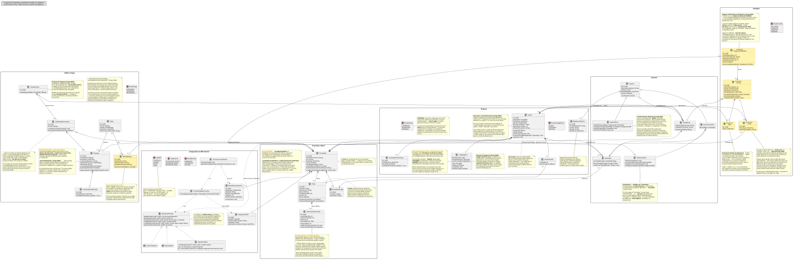

# Documentación del Diagrama de Clases — Aliflow

Este diagrama modela la **lógica de negocio** del sistema (no las clases de infraestructura/ORM/framework), organizada en 6 paquetes.

---

## 1. Paquete "Usuarios"
**`SuperAdmin` extiende `Usuario` directamente, no `UsuarioProveedor`** — y esa distinción es deliberada: `UsuarioProveedor` obliga a pertenecer a un local (`# proveedor: Proveedor`), y el Super-Admin es el único rol **sin** local, con visibilidad sobre todos los tenants. Da de alta locales nuevos, les crea su vista de proveedor, configura su integración con el ERP y brinda soporte.

Jerarquía de herencia con **`Usuario`** como clase abstracta base (id, nombreCompleto, email, fechaRegistro, activo), especializada en:

- **`Estudiante`** — mapea al actor "Estudiante".
- **`UsuarioProveedor`** (abstracta) — una persona con acceso al panel de un local específico (`# proveedor: Proveedor`). Se especializa en:
  - **`Administrador`** — mapea al actor **"Proveedor"**: administra menú, métricas, la integración con el ERP del local, y las cuentas del personal de su propio local (UC12).
  - **`Operador`** — mapea al actor "Operador": valida las compras de los estudiantes y marca la entrega física. Asociado a un `PuntoDeEntrega` específico.

**Nota de vocabulario (importante para no perderse en el diagrama):** la palabra "Proveedor" designa dos cosas distintas.

| En el lenguaje de el cliente | En el diagrama de clases | Qué es |
|---|---|---|
| Rol **"Proveedor"** (= "Administrador", el gerente) | clase `Administrador` | una **persona** con cuenta en Aliflow |
| El **local** / proveedor de alimentación (Barú, Caramel Coffee) | clase `Proveedor` | el **negocio**: el tenant, con su menú, su ERP y su personal |

Se conservó `Proveedor` como nombre de la entidad-negocio porque así se usa en el acta ("proveedores de alimentación") y en todo el resto del modelo (`SaldoProveedor`, `IntegracionERP`, `tenantId`). Renombrarla habría propagado churn a ~10 archivos sin ganar claridad real; la tabla de arriba y una nota dentro del propio diagrama resuelven la ambigüedad.

**Qué se eliminó:** la clase `Administrador` que colgaba directamente de `Usuario` (el super-admin, con `darDeAltaProveedor` y `gestionarUsuarios`), y las clases `Propietario`/`Cajero`, renombradas a `Administrador`/`Operador` para usar el vocabulario oficial de el cliente en vez del informal del equipo.

**Personal múltiple por local — confirmado, ya no es propuesta.** se definió que un local puede tener **varias** cuentas de Proveedor y varias de Operador. Las cardinalidades quedaron en `Proveedor "1" *-- "1..*" Administrador` (al menos un gerente) y `Proveedor "1" *-- "0..*" Operador`. Estas clases perdieron el estereotipo `<<propuesta>>` y el fondo amarillo.

## 2. Paquete "Proveedor y Menú"

**`Proveedor`** (el tenant/negocio — en la práctica, cada local de comida de la universidad: Barú, Caramel Coffee, etc.) agrega su personal (`UsuarioProveedor`), sus puntos de entrega físicos (`PuntoDeEntrega`) y su menú (`Plato`). `Plato.hayStock` encapsula la validación de disponibilidad que en el flujo se menciona como "revalidación de stock justo antes de confirmar" (`est-4`).

**Control de concurrencia** `Plato` ahora tiene un campo `version` y un método `reservarStock(cantidad)` — implementa bloqueo optimista para el riesgo ya identificado desde el flujo original ("dos estudiantes no deben poder comprar la última unidad simultáneamente"). Antes este riesgo estaba documentado en prosa pero no tenía ningún elemento correspondiente en el diagrama de clases; el detalle exacto de la transacción se completa en el diagrama de secuencia.

**Validado empíricamente (, ver `../../../demo-odoo/README.md` sección 7):** se probó implementar este mismo bloqueo directamente contra el ERP externo (Odoo, vía RPC) y falló bajo concurrencia real (5 hilos comprando con 3 unidades de stock vendieron las 5). Esto confirma que `Plato.version`/`reservarStock` deben vivir en la base de datos propia de Aliflow, no delegarse al ERP — la prueba de concurrencia repetida contra un dominio local con lock real (`../../../demo-odoo/plato_local.py`) sí se comportó correctamente.

### La clase `InventarioReservado`

La clase nueva más importante de esta revisión, y la que cambia cómo se decide si Aliflow puede vender.

**El problema que resuelve.** El ERP del local descuenta al instante cuando alguien compra en caja, pero Aliflow puede tardar en enterarse. En esa ventana, un estudiante compra algo que ya no existe. Son **dos escritores sobre el mismo contador** sin transacción común: sincronizar más seguido achica la ventana, no la cierra.

**Cómo lo resuelve.** El proveedor aparta un cupo exclusivo para Aliflow (de 100 almuerzos: 75 a caja, 25 a Aliflow) y lo administra desde su panel (UC16). **Aliflow valida la compra contra `InventarioReservado.disponible`, no contra `Plato.stockDisponible`.**

**Por qué es la solución correcta y no un parche:** convierte un problema de consistencia distribuida —difícil, y sin solución completa cuando no se controlan los dos sistemas— en uno de **partición de recursos**, que es trivial. Aliflow deja de competir por un dato compartido porque pasa a ser dueño exclusivo del suyo.

`Plato.stockDisponible` no desaparece: queda como **espejo informativo** del ERP, útil para conciliar y para que el proveedor decida cuánto asignar. `InventarioReservado` conserva su propio `version` para el bloqueo optimista, porque dos estudiantes sí pueden pelear por la última unidad **del cupo**.

**Costo que introduce, registrado como riesgo R-20:** el cupo depende de que el proveedor lo mantenga al día. Si no lo repone, Aliflow muestra "agotado" mientras el local tiene comida — y el fallo es silencioso, porque nadie reclama por lo que no puede comprar.

## 3. Paquete "Wallet y Pagos"

**El saldo pertenece al establecimiento, no al estudiante.** El estudiante recarga *para un local* y solo puede gastar ahí. El dinero va de la pasarela **directo a la cuenta de ese proveedor**; Aliflow no lo recibe ni lo custodia en ningún momento.

`TarjetaVirtual` es el contenedor que agrupa un `SaldoEstablecimiento` por cada local en el que el estudiante haya recargado. `SaldoEstablecimiento` es el saldo real en ese local: una compra en un establecimiento nunca puede consumir el saldo de otro, y no existe transferencia entre ellos.

`Recarga` lleva el establecimiento destino como dato obligatorio, y `Proveedor` guarda su cuenta bancaria y sus credenciales de comercio, porque cada local recibe directamente el dinero de sus recargas.

`Pago` (con `EstadoPago`: APROBADO/PENDIENTE/RECHAZADO) genera una `Recarga` solo si es aprobado. `ComprobanteRecarga` es el comprobante interno sin validez tributaria. `MetodoPago` guarda únicamente tipo de tarjeta, últimos cuatro dígitos y el token de la pasarela: Aliflow nunca almacena el número completo ni el código de seguridad.

## 4. Paquete "Órdenes"

**`Orden`** agrega una o más `OrdenDetalle` (plato + cantidad + precio unitario — generalización razonable sobre el flujo, que describe la compra de un plato a la vez, pero sin costo de diseño adicional soporta más de un ítem). Tiene un `CodigoRetiro` propio (value object: valor, fechaExpiracion, usado).

**Formato del código, cerrado:** se definió **código numérico corto de 6 dígitos**, descartando la propuesta previa de el equipo de desarrollo (UUID firmado con expiración). La razón es operativa y es buena: el estudiante se lo dice de viva voz al Operador, que lo digita en Aliflow para marcar el retiro — un UUID de 36 caracteres es impracticable para eso. Dos consecuencias de diseño quedaron anotadas en el diagrama:

1. **La unicidad se acota.** Seis dígitos son ~10⁶ combinaciones: suficientes solo si la unicidad se exige entre los códigos **vigentes de un mismo local**, no globalmente ni de forma histórica. La generación reintenta ante colisión.
2. **El código pasa a ser adivinable.** Un UUID firmado no se puede adivinar; 6 dígitos sí. Registrado como riesgo **R-15** en `../01-Especificacion-de-Requerimientos/06-Gestion-de-Riesgos.md` con su mitigación (límite de intentos + el hecho de que el Operador ve físicamente al estudiante).

`EstadoOrden` incluye **`EXPIRADO`** además de `COMPRADO`/`ENTREGADO` — esto no estaba en el flujo original; se agrega para cubrir el vacío ya detectado de "no hay estado para una orden nunca retirada" (`../../../Hallazgos-Ingenieria-API-Generica.md`, sección 5.3). Es una propuesta de diseño, marcada ahora también dentro del propio diagrama (nota amarilla junto a `EstadoOrden`), pendiente de que el cliente defina la regla exacta (después de cuánto tiempo expira, si hay reembolso, etc. — esto último sigue fuera de alcance de v1 según el acta).

`ComprobanteCompra` es el comprobante interno sin validez tributaria (`est-4`/`prov-6`), distinto de la factura real que el proveedor emite en su propio ERP.

**Regla de un solo local por orden (corregida ):** `Orden` ahora tiene una asociación directa a `Proveedor` (no solo indirecta vía `OrdenDetalle → Plato → Proveedor`), con un invariante explícito en el diagrama: todos los `OrdenDetalle` de una misma `Orden` deben pertenecer a platos del mismo proveedor. Antes de esta corrección, el modelo permitía —sin querer— una orden con platos de proveedores distintos, lo cual habría roto el resto de la arquitectura (saldo por proveedor, un solo `tenantId` por llamada a `notifySale`, un evento de sincronización por orden). `confirmarCompra` es responsable de validar este invariante antes de crear la orden.

**Auditoría (agregada ):** `RegistroAuditoria` responde al riesgo R-09 (`../01-Especificacion-de-Requerimientos/06-Gestion-de-Riesgos.md`), que pedía explícitamente registro de auditoría para compras y redenciones — antes este requisito estaba documentado como riesgo pero no tenía ninguna clase correspondiente. Registra quién ejecutó `confirmarCompra`, `marcarEntregado`, `invalidar` y la acreditación interna al local.

## 5. Paquete "Fidelidad"

se definió una **cartilla de fidelidad**: el estudiante acumula un sello por compra y al completar la cartilla gana un premio. **Las cinco reglas quedaron confirmadas** y el paquete perdió el `<<propuesta>>`. Siguen sin definirse solo dos valores —cuántos sellos y cuál es el premio—, que por diseño son configuración y no constantes.

**La decisión de diseño que evita quedarse esperando:** los dos datos que faltan (`sellosRequeridos`, `descripcionPremio`) se modelan como **campos configurables de `ProgramaFidelidad`**, no como constantes. Cuando el cliente los defina, es un valor en base de datos — no hay que rediseñar ni reprogramar nada. Lo mismo con `vigenciaCartillaDias` (si el cliente decide que la cartilla no caduca, el campo queda nulo) y con `maxSellosPorDia`.

**Cuatro decisiones de diseño que el equipo de desarrollo tomó y que se definió:**

1. **El programa es por local, no de la plataforma.** `ProgramaFidelidad` cuelga de `Proveedor`. La razón es económica, no técnica: el premio lo regala el local, así que es el local quien debe poder decidir si lo ofrece, cuántos sellos pide y qué da. Un local puede no tener programa. Como consecuencia, el estudiante tiene **una cartilla activa por local**, no una sola global.
2. **El sello se acredita al entregar, no al comprar.** `Sello` se crea dentro de `Orden.marcarEntregado`, no de `confirmarCompra`. Si se acreditara al comprar, un estudiante podría llenar la cartilla comprando almuerzos y nunca yendo a buscarlos — el local pagaría el premio sin haber vendido nada real. Además el sello así acompaña al acto físico, que es lo que el negocio quiere premiar.
3. **Un sello por orden, garantizado por el modelo.** La asociación `Sello --> Orden` es 1 a 1 con restricción de unicidad. Si la confirmación de entrega se reintenta (fallo de red, doble clic del Operador), la segunda inserción falla y no se acredita dos veces. Es el mismo principio de idempotencia que ya se usa en el outbox con `eventId`.
4. **Un sello por día como tope por defecto.** `maxSellosPorDia = 1`. Sin este límite, la cartilla premia volumen en vez de recurrencia, y se puede llenar en un solo día comprando el ítem más barato del menú varias veces. Este punto depende de lo que el cliente haya querido decir con "10 veces diarias" — ver `../../../Decisiones-Pendientes-Negocios.md`, punto 9.

**El canje toca el resto del sistema en tres lugares:**

- **`Orden.esCanje` + `descuento` + `motivoDescuento`** — el canje se aplica sobre una orden real con **descuento del 100% rotulado como premio**, no con total $0. Tiene que ser una orden de verdad porque el plato igual sale del cupo y el estudiante igual necesita un código de retiro. *(se había propuesto la orden de $0; se definió el descuento, y es mejor: conserva el precio original, así el local puede ver cuánto le costaron los premios — un dato que con $0 no existía.)*
- **La wallet no se toca.** No se descuenta el `SaldoEstablecimiento` del estudiante: el premio lo regala el local, no se paga con saldo.
- **El ERP sí se entera, y el problema que había aquí se resolvió.** Antes la duda era si un `notifySale` de $0 sería rechazado por el ERP como error, y si había que emitirlo como documento de cortesía o como descuento. **La respuesta de el cliente lo decidió: descuento del 100%**, que además es una operación normal para cualquier ERP. Queda solo verificar contra la documentación de Contífico y de Alpwin que ambos lo admiten en línea de venta.

**Concurrencia:** el paso `COMPLETA → CANJEADA` usa el mismo mecanismo atómico y condicional que la redención del código de retiro (`UPDATE... WHERE estado = 'COMPLETA'`). Si dos pestañas del estudiante intentan canjear a la vez, la segunda afecta 0 filas y falla sin crear la orden.

## 6. Paquete "Integración con ERP externo"

Materializa directamente la arquitectura ya diseñada en `../../../Hallazgos-Ingenieria-API-Generica.md` (sección 3):

- **`IInventoryProvider`** (interfaz/puerto) — el core de Aliflow (representado aquí por la dependencia `Orden..> IInventoryProvider`) solo conoce esta abstracción, nunca un ERP concreto.
- **`ContificoAdapter`**, **`AlpwinAdapter`**, **`OdooAdapter`** — adaptadores concretos (patrón **Adapter**). `AlpwinAdapter` lleva una nota explícita: al no tener API pública, su implementación real sería por archivos/BD puente, no llamadas síncronas.
- **`ProviderAdapterFactory`** — patrón **Factory Method**: dado un `Proveedor`, lee su `IntegracionERP.tipoERP` y devuelve la implementación concreta correspondiente. Nadie más en el sistema necesita un `switch`/`if` sobre el tipo de ERP.
1. **Varios adaptadores conviven en producción**, no uno. Antes se asumía un único ERP objetivo y la factory era casi decorativa; ahora es la pieza que hace funcionar el multi-tenant real. El diseño no cambió — es exactamente lo que el patrón Adapter + Factory estaba pensado para soportar — pero pasó de "buena práctica defensiva" a "sin esto el producto no existe".
2. **La interfaz es bidireccional** y eso ahora está explícito. `getMenu`/`getStock` traen el inventario del local hacia Aliflow; `updateStock`/`notifySale` y el nuevo **`notifyPayment`** devuelven al ERP las órdenes y los pagos, para que su inventario y su contabilidad queden sincronizados. Se agregó `TipoEvento.NOTIFICAR_PAGO` al outbox por la misma razón.
3. **`TipoERP` cambió de contenido y de rol.** Ahora es `CONTIFICO | ALPWIN | ODOO | OTRO`, con Contífico primero por ser el del local piloto. El valor `OTRO` es deliberado: agregar un local con un ERP desconocido debe ser un valor de enum más una clase adaptadora, sin tocar el core.
- **`EventoSincronizacion`** + **`SincronizacionWorker`** — implementan el patrón **Outbox** ya diseñado: cada venta genera un evento (`TipoEvento.NOTIFICAR_VENTA`), que el worker procesa con reintentos (`EstadoEvento`: PENDIENTE/PROCESADO/FALLIDO), evitando la "venta huérfana" ya identificada como riesgo (R-02 en `../01-Especificacion-de-Requerimientos/06-Gestion-de-Riesgos.md`).

---

## Principios SOLID aplicados

| Principio | Dónde se aplica |
|---|---|
| **S — Responsabilidad única** | `Orden` gestiona su propio estado y ciclo de vida; la traducción a cada ERP vive exclusivamente en su adaptador; `SincronizacionWorker` solo orquesta reintentos, no lógica de negocio de la venta. |
| **O — Abierto/cerrado** | Agregar un ERP nuevo = una clase `NuevoErpAdapter` nueva, cero cambios al core (`IInventoryProvider` ya definido). *(El otro ejemplo que había aquí, `EstrategiaDistribucionRecarga`, se eliminó al quedar sin problema que resolver — ver sección 3.)* |
| **L — Sustitución de Liskov** | Cualquier `IInventoryProvider` (Contífico/Alpwin/Odoo) es intercambiable sin que el código que lo usa (`SincronizacionWorker`, `Orden`) se entere de la diferencia. Con varios locales activos a la vez, esto se ejercita de verdad en producción, no solo en teoría. |
| **I — Segregación de interfaces** | `IInventoryProvider` se mantiene deliberadamente pequeña (6 métodos, todos relacionados a inventario/venta/pago) — no se mezcla con responsabilidades de facturación fiscal, que quedan fuera de esta interfaz. |
| **D — Inversión de dependencias** | `ProviderAdapterFactory` y `SincronizacionWorker` dependen de la abstracción `IInventoryProvider`, nunca de `OdooAdapter`/`ContificoAdapter`/`AlpwinAdapter` directamente. |

## Patrones de diseño usados

- **Adapter** — resuelve directamente el reto técnico central del proyecto (integrar con ERPs heterogéneos sin acoplarse a ninguno).
- **Factory Method** (`ProviderAdapterFactory`) — evita que la lógica de "qué adaptador usar" se disperse por el código; centraliza la decisión en un solo lugar.
- ~~**Strategy** (`EstrategiaDistribucionRecarga`)~~ — **eliminado.** Servía para encapsular cómo se repartía internamente una recarga única entre locales. Con la recarga por establecimiento ya no hay reparto, así que el patrón se quedó sin problema que resolver y se retiró en vez de conservarse por las dudas. Ver sección 3.
- **Outbox** (arquitectural, no GoF clásico) — ya validado técnicamente en el demo con Odoo Community (`../../../Hallazgos-Ingenieria-API-Generica.md`, sección 4.2).

No se forzaron patrones adicionales (ej. Singleton, Observer) donde no había un problema real que resolver — evitar ese "mal olor" de sobre-ingeniería fue una decisión deliberada. El criterio se aplica en ambos sentidos: un patrón que deja de resolver un problema se retira, porque conservarlo sería el mismo mal olor.

## Malos olores evitados

- **God class**: no existe una clase "Sistema" o "AliflowService" que concentre toda la lógica — cada responsabilidad vive en la clase del dominio que le corresponde.
- **Primitive obsession**: `CodigoRetiro` y los comprobantes son objetos propios (con su propia validación) en vez de campos sueltos tipo `String codigo` regados por otras clases.
- **Acoplamiento a implementación externa**: ninguna clase de dominio (`Orden`, `Plato`, `Proveedor`) importa o conoce un SDK específico de Odoo/Contífico — todo pasa por `IInventoryProvider`.
