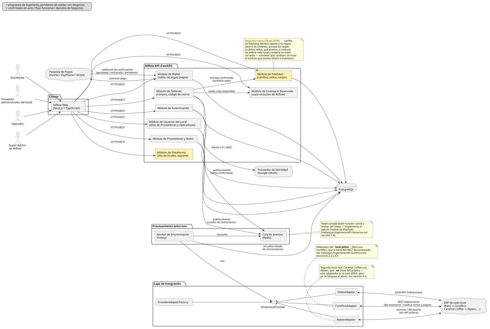

# Documentación del Diagrama de Componentes — Aliflow

**Diagrama fuente:** `../../uml/diagrama-componentes.puml`.

Este diagrama incorpora, por primera vez en la documentación formal del proyecto, el **stack tecnológico** recuperado de investigación previa del equipo (conversación revisada el 26-jul-2026): Next.js en el cliente, FastAPI en el backend, PostgreSQL como base de datos, y Redis/Celery para procesamiento asíncrono. Hasta ahora esta información solo existía en una conversación externa — queda aquí formalizada como parte del diseño.

**Convención visual (revisión 27-jul-2026):** el "Módulo de Administración" aparece con fondo amarillo — misma convención que en `../../uml/diagrama-clases.puml` y `../../uml/casos-de-uso.puml` — porque expone los casos de uso UC12-UC14, propuesta de Ingeniería sin validar con Negocios.

## Componentes principales

### Cliente
- **Aliflow Web (Next.js + TypeScript)** — única aplicación web que sirve a los **3 roles** del sistema (Estudiante, Proveedor, Operador — decisión de Negocios del 28-jul-2026; no existe un rol de super-admin de plataforma), consumiendo la API vía HTTPS/REST. No hay apps nativas separadas por rol; la diferenciación de interfaz ocurre por rol de sesión, no por despliegue distinto.

### Aliflow API (FastAPI)
Organizada en módulos, cada uno mapeado a los paquetes del diagrama de clases:
- **Módulo de Autenticación** — implementa UC1 (OAuth institucional) y UC6 (login operativo); es el único módulo que habla con el **Proveedor de Identidad** externo.
- **Módulo de Wallet** — implementa UC2 (recarga); es el único módulo que habla con la **Pasarela de Pagos**.
- **Módulo de Órdenes** — implementa UC4/UC5 (compra, retiro); publica eventos a la cola cuando se confirma una venta.
- **Módulo de Proveedores y Menú** — implementa UC7/UC8 (integración, administración de menú).
- **Módulo de Fidelidad** *(nuevo, 28-jul-2026)* — implementa UC13/UC14/UC15 y el sub-flujo UC5d: cartillas, sellos y canjes. Se modela como módulo aparte y no como lógica dentro de Órdenes por una razón concreta: las reglas del programa (cuántos sellos, qué premio, tope diario, si caduca) las define cada local y todavía no están cerradas. Conviene que puedan cambiar sin tocar el módulo que mueve dinero e inventario. La flecha `Órdenes → Fidelidad` refleja que el sello se acredita cuando la entrega se confirma.
- **Módulo de Usuarios del Local** — implementa UC12: permite que un Proveedor (administrador del local) dé de alta y revoque a otros Proveedores y a los Operadores de **su propio** local. Reemplaza al antiguo "Módulo de Administración", que existía para un rol de super-admin de plataforma ya descartado por Negocios (28-jul-2026).

Todos los módulos persisten en **PostgreSQL** directamente (no hay una capa de repositorio separada mostrada aquí — a ese nivel de detalle correspondería un diagrama de clases de infraestructura, fuera del alcance de "lógica de negocio" que pide la rúbrica).

### Capa de Integración
Es la traducción directa a componentes del patrón Adapter ya diseñado (`../../../Hallazgos-Ingenieria-API-Generica.md` sección 3, `../../uml/diagrama-clases.puml`): la interfaz **IInventoryProvider** (notación de lollipop) es implementada por `ContificoAdapter`, `AlpwinAdapter` y `OdooAdapter`, y `ProviderAdapterFactory` decide cuál instanciar **según el local**. Ningún otro componente del sistema depende de un adaptador concreto — solo de la interfaz.

Esta capa dejó de ser una previsión y pasó a ser un requisito duro con la confirmación de Negocios del 28-jul-2026: **cada local de la universidad usa un ERP distinto** (Barú → Contífico, Caramel Coffee → Alpwin, etc.), así que en producción van a convivir varios adaptadores simultáneamente, no uno solo. Las flechas hacia el ERP se dibujan **bidireccionales**: Aliflow lee inventario y menú desde el ERP del local, y le devuelve las órdenes y los pagos para que su inventario quede sincronizado.

### Procesamiento asíncrono
- **Cola de eventos (Redis)** — recibe eventos publicados por Órdenes y por Proveedores/Menú (venta confirmada, cambio de stock).
- **Worker de Sincronización (Celery)** — consume la cola, usa la Capa de Integración para notificar al ERP externo, y actualiza el estado de sincronización en la base de datos. Es la implementación concreta del patrón Outbox.

### Sistemas externos
- **Proveedor de Identidad (Google OAuth)** — ya documentado desde el flujo original (`est-1`).
- **Pasarela de Pagos (Kushki / PayPhone / Stripe)** — nueva incorporación formal; son las opciones que se manejaron en la investigación previa del equipo para el riesgo R-06 (`../01-Especificacion-de-Requerimientos/06-Gestion-de-Riesgos.md`) sobre limitaciones del ambiente de pruebas de pagos.
- **ERP de cada local** — no es un solo sistema: Barú usa **Contífico** (API REST documentada, el caso fácil y el del local piloto) y Caramel Coffee usa **Alpwin** (sin API pública, integración por archivos/BD puente). Ver notas en el diagrama y `../../../Hallazgos-Ingenieria-API-Generica.md` sección 4.3.

## Decisiones de este diagrama que quedan abiertas

1. **Elección final de pasarela de pago** (Kushki vs. PayPhone vs. Stripe) — no se ha decidido, solo se documentan como candidatas evaluadas previamente.
2. **Redis con doble rol** (caché + broker de Celery) es una simplificación de infraestructura razonable para el alcance del proyecto universitario; en un entorno de producción más grande podría separarse en dos servicios.
3. El **Módulo de Administración** expone los casos de uso UC12-UC14 que Ingeniería propuso pero Negocios no ha validado — se incluye aquí por consistencia con el diagrama de clases, no porque su alcance esté cerrado.
