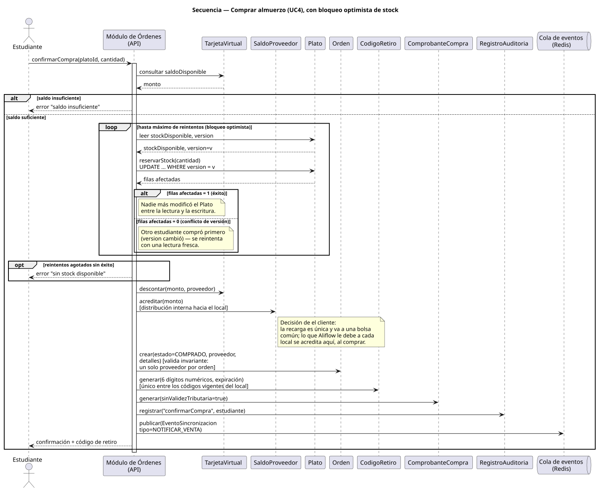
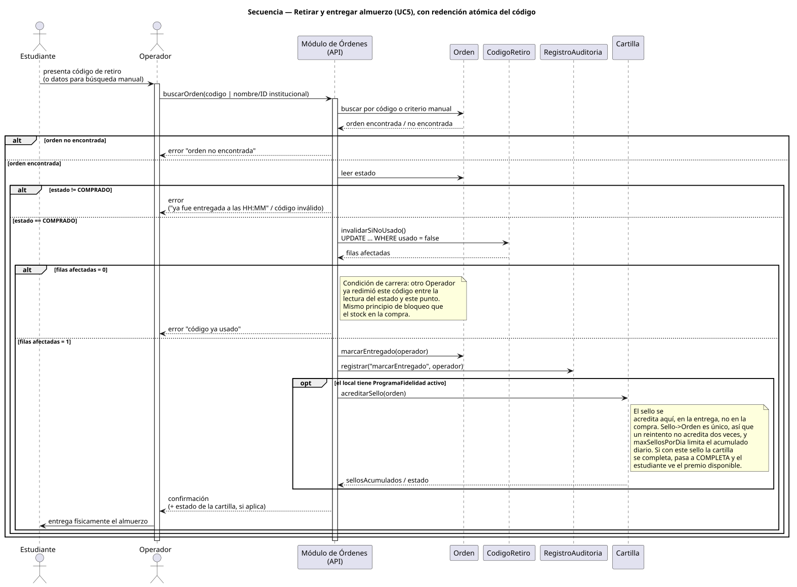
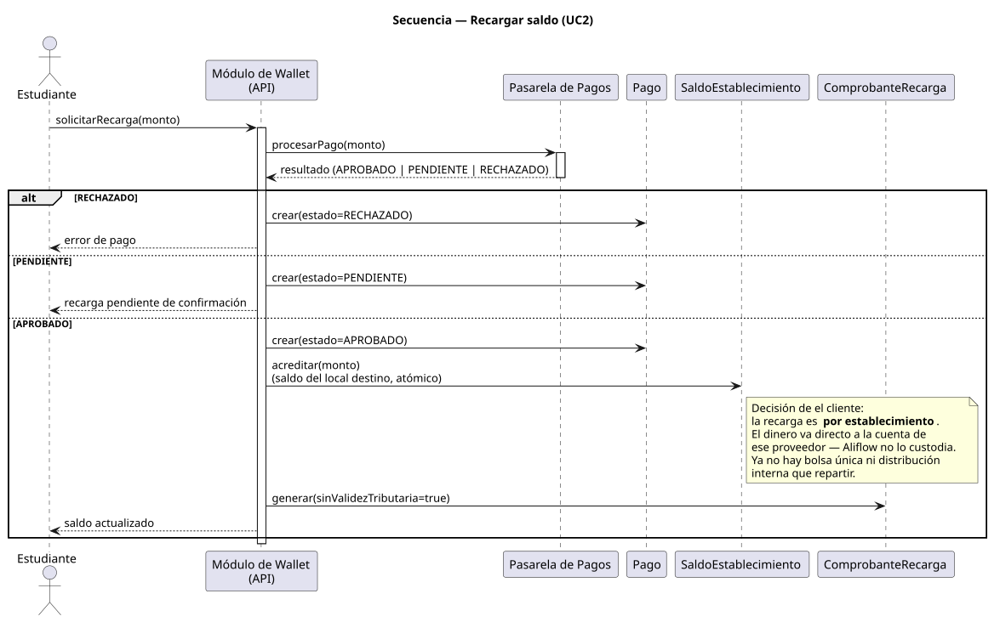
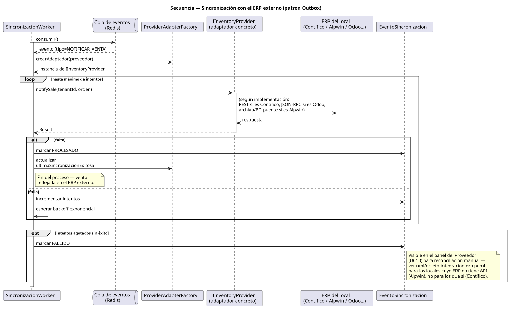

# Documentación de Diagramas de Secuencia — Aliflow

Cuatro diagramas de secuencia, cubriendo los **algoritmos transaccionales relevantes** del sistema: los que mueven dinero, cambian estado de forma atómica, o dependen de un sistema externo con posibilidad de fallo.

---

## 1. Comprar almuerzo (el algoritmo central)

**Fuente:** `../../uml/secuencia-compra-almuerzo.puml` · **Referencia:** UC4, `../../uml/actividad-compra-almuerzo.puml`.

Este es el diagrama que **resuelve en detalle** el control de concurrencia que quedó pendiente en el diagrama de clases (`Plato.version` / `reservarStock()`, agregado en la revisión anterior): el `loop` muestra explícitamente que la actualización de stock es un `UPDATE ... WHERE version = v`, y que si otro estudiante ya compró primero (0 filas afectadas), se reintenta con una lectura fresca en vez de fallar o, peor, descontar stock que ya no existe. Esto es lo que evita la venta duplicada de la última unidad — un riesgo que estaba documentado en el flujo original desde el principio pero que no tenía, hasta ahora, un mecanismo concreto mostrado en ningún diagrama.

## 2. Retirar y entregar almuerzo (redención atómica del código)

**Fuente:** `../../uml/secuencia-retiro-entrega.puml` · **Referencia:** UC5.

**Hallazgo nuevo de esta revisión, no documentado antes:** el mismo tipo de condición de carrera que existe en el stock (dos compras simultáneas por la última unidad) también puede ocurrir aquí — dos Operadores validando el mismo código casi al mismo tiempo. Se resuelve con el mismo principio (`UPDATE ... WHERE usado = false`, atómico a nivel de base de datos): si la actualización afecta 0 filas, significa que alguien más ya redimió el código en el intervalo, y se informa como error en vez de marcar una segunda entrega. No hace falta ningún campo nuevo en `CodigoRetiro` (el booleano `usado` ya alcanza), solo que la actualización sea atómica y condicional.

**Ampliado el 28-jul-2026** con el bloque `opt` de acreditación del sello de la cartilla de fidelidad, que ocurre después de `marcarEntregado()`. Va dentro de un `opt` y no de la rama principal porque el programa de fidelidad es **opcional por local**: si el local no lo tiene activo, el flujo de entrega es idéntico al de antes.

## 3. Recargar saldo

**Fuente:** `../../uml/secuencia-recarga-saldo.puml` · **Referencia:** UC2.

Incluye la rama `PENDIENTE` del pago (no solo APROBADO/RECHAZADO), consistente con que las pasarelas candidatas (Kushki/PayPhone/Stripe, ver `../../uml/diagrama-componentes.puml`) suelen tener estados intermedios asíncronos. **Actualizado el 28-jul-2026:** con la decisión de Negocios de recarga única, el paso de distribución desapareció de esta secuencia — el pago aprobado acredita directamente `TarjetaVirtual.saldoDisponible` y se emite el comprobante. La acreditación al local se movió a `../../uml/secuencia-compra-almuerzo.puml`.

## 4. Sincronización con el ERP externo (patrón Outbox)

**Fuente:** `../../uml/secuencia-sincronizacion-erp.puml` · **Referencia:** `../../../Hallazgos-Ingenieria-API-Generica.md` sección 3.4, `../../uml/objeto-integracion-erp.puml`, `../../uml/actividad-sincronizacion-erp.puml`.

Muestra el mismo proceso que el diagrama de actividad correspondiente, pero a nivel de mensajes entre objetos concretos — útil para ver exactamente qué le llega a `IInventoryProvider` (`notifySale(tenantId, orden)`) y qué determina si el evento se reintenta o se marca `FALLIDO`.

---

## Por qué estos 4 y no otros

Los demás procesos (consultar menú, administrar menú, configurar integración, consultar métricas) no involucran atomicidad, dinero, ni un sistema externo que pueda fallar a mitad de camino — son operaciones de lectura o escritura simple, sin el tipo de complejidad que un diagrama de secuencia está pensado para exponer. Se cubrieron en cambio con el diagrama de actividad correspondiente cuando tenían alguna rama de decisión relevante.

## Hallazgo transversal de esta ronda

Al diseñar el diagrama de retiro, se detectó una condición de carrera (doble redención del código) que no estaba identificada en ningún documento anterior — ni en el flujo original, ni en `../01-Especificacion-de-Requerimientos/06-Gestion-de-Riesgos.md`. Vale la pena agregarla formalmente al registro de riesgos como un riesgo más (probabilidad baja, dado que requiere dos Operadores validando el mismo código en el mismo instante, pero impacto real si ocurre: dos entregas físicas de un mismo almuerzo).
