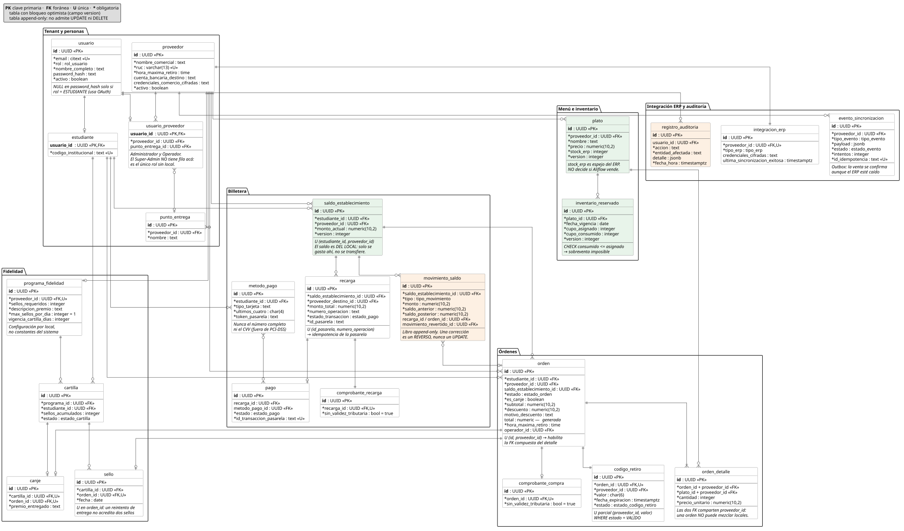

# Entregable 04 · Modelo de la base de datos

**10 puntos de rúbrica.** Motor: **PostgreSQL 16**.

| Artefacto | Archivo |
|---|---|
| Diagrama entidad-relación | [`../../uml/modelo-datos.puml`](../../uml/modelo-datos.puml) · [`.svg`](../../uml/modelo-datos.svg) |
| Esquema ejecutable (DDL) | [`esquema.sql`](esquema.sql) |
| Pruebas de las restricciones | [`pruebas-restricciones.sql`](pruebas-restricciones.sql) |



---

## 1. El criterio de este esquema

**Toda regla de negocio que se pueda expresar como restricción declarativa se expresa en la base de datos, no en el código.** Una regla que vive solo en la aplicación se rompe la primera vez que alguien escribe por otro camino: un script de migración, una corrección manual, un endpoint nuevo que se olvidó de validar.

No todo se puede. Donde no se pudo, está dicho explícitamente y con la razón — sección 6.

**24 tablas, 37 restricciones CHECK propias, 9 tipos enumerados y 2 triggers de inmutabilidad.**

---

## 2. Las decisiones que definen este modelo

### 2.1 El saldo es un libro de movimientos, no una columna

`saldo_establecimiento.monto_actual` existe, pero **es un caché**. La verdad son las filas de `movimiento_saldo`, que es *append-only*: un trigger rechaza cualquier `UPDATE` o `DELETE`.

Se eligió así por RF-56, que exige histórico sin borrado y correcciones mediante **movimiento compensatorio**. Pero tiene un segundo efecto que valió la decisión: **desactiva por adelantado la única decisión de negocio que todavía puede cambiar la billetera.** Qué pasa con el dinero de una orden vencida sigue sin definirse; con este modelo, cualquiera de las respuestas posibles —se devuelve, se pierde, se le queda al proveedor— es un movimiento más y no un cambio de esquema.

Si el saldo fuera una columna mutable, la respuesta "se devuelve" obligaría a rehacer la billetera.

Cada movimiento guarda `saldo_anterior` y `saldo_posterior`, y una restricción verifica que cuadren:

```sql
CONSTRAINT movimiento_cuadra CHECK (saldo_posterior = saldo_anterior + monto)
```

La consistencia entre el caché y el libro se verifica con la consulta de conciliación del final de `esquema.sql`, que debe devolver **cero filas siempre**.

### 2.2 El Super-Admin no puede tener local, y lo impide la base

El diagrama de clases hizo `SuperAdmin` heredar de `Usuario` y **no** de `UsuarioProveedor`, a propósito: es el único rol sin local. Esa distinción se preserva con tabla base más tablas hijas.

- `usuario` — lo común a los cuatro roles.
- `estudiante` — código institucional.
- `usuario_proveedor` — `proveedor_id` **NOT NULL**, para Administrador y Operador.

El Super-Admin tiene fila en `usuario` y en ninguna hija. **No hay dónde ponerle un local.** Con una tabla única y `proveedor_id` nullable, esa regla habría dependido de que el código no se olvidara.

Además, las tablas hijas llevan una FK compuesta `(usuario_id, rol)` contra `usuario(id, rol)`, así que tampoco se puede colgar una fila de `estudiante` de un usuario que sea Operador.

### 2.3 Una orden no puede mezclar locales, y tampoco depende del código

RN-01 dice que todos los ítems de una orden pertenecen al mismo local. En el diagrama de clases era un invariante en una nota; acá es estructura:

```sql
FOREIGN KEY (orden_id, proveedor_id) REFERENCES orden(id, proveedor_id)
FOREIGN KEY (plato_id, proveedor_id) REFERENCES plato(id, proveedor_id)
```

Las dos claves foráneas comparten la columna `proveedor_id`. Un plato de otro local **no tiene dónde encajar**: no existe combinación de valores que satisfaga ambas a la vez.

### 2.4 La sobreventa es imposible, no improbable

```sql
CONSTRAINT cupo_no_sobrevendido CHECK (cupo_consumido <= cupo_asignado)
```

Es la traducción a SQL de la decisión #10. Aliflow vende contra `inventario_reservado`, nunca contra `plato.stock_erp`, que queda como espejo informativo del ERP. Con esta restricción, sobrevender requeriría violar la base de datos.

`inventario_reservado` y `plato` llevan campo `version` para bloqueo optimista. **Ese control vive acá y no en el ERP** porque se probó delegarlo y falló: cinco hilos comprando con tres unidades vendieron cinco (`demo-odoo/README.md` §7).

### 2.5 El código de retiro y su unicidad acotada

Seis dígitos son ~10⁶ combinaciones, que solo alcanzan si la unicidad se exige entre los códigos **vigentes de un mismo local** — no global ni histórica. Un índice parcial lo expresa exactamente:

```sql
CREATE UNIQUE INDEX ux_codigo_vigente_por_local
    ON codigo_retiro (proveedor_id, valor)
    WHERE estado = 'VALIDO';
```

Por eso `proveedor_id` está desnormalizado en `codigo_retiro`: un índice parcial necesita la columna en la propia tabla.

### 2.6 El canje conserva el precio

`orden` tiene `subtotal`, `descuento`, `motivo_descuento` y una columna **generada** `total = subtotal - descuento`. Un canje es una orden con descuento del 100%, no una venta de $0:

```sql
CONSTRAINT canje_descuento_total CHECK (NOT es_canje OR descuento = subtotal)
```

Así el local puede ver cuánto le costaron los premios (RF-38), dato que con una orden de $0 no existiría. Y `orden.saldo_establecimiento_id` es nullable **solo** para canjes, porque el premio no se paga con saldo.

---

## 3. Cómo se protege cada regla de negocio

| Regla | Cómo la impide la base de datos |
|---|---|
| **RN-01** Una orden, un solo local | FK compuestas que comparten `proveedor_id` |
| **RN-02** Se vende contra el cupo, no contra el ERP | `CHECK cupo_consumido <= cupo_asignado` |
| **RN-03** El código vale solo el día de la compra | `fecha_expiracion` + enum de estado *(la transición la hace una tarea programada)* |
| **RN-04** Código de un solo uso | Enum de estado + índice parcial sobre los vigentes |
| **RN-05** Horarios y premios son configuración | Columnas en `proveedor` y `programa_fidelidad`, sin constantes |
| **RN-06** Nunca el número de tarjeta ni el CVV | La tabla `metodo_pago` no tiene esas columnas |
| **RN-07** Aislamiento entre locales | FK compuestas *(el filtrado por consulta es del backend — ver §6)* |
| **RN-08** Un sello por orden | `sello.orden_id` UNIQUE |
| **RN-09** Aliflow no emite documentos fiscales | `CHECK (sin_validez_tributaria)` en ambos comprobantes |
| **RN-10** Auditoría de operaciones sensibles | `registro_auditoria` + trigger de inmutabilidad |
| **RN-11** La concurrencia vive en Aliflow | Campo `version` en `plato`, `inventario_reservado` y `saldo_establecimiento` |
| **RN-12** El canje es descuento del 100% | `CHECK canje_descuento_total` |
| **RN-13** El saldo es del establecimiento | UNIQUE `(estudiante_id, proveedor_id)` + FK compuesta en `orden` |
| **RN-14** Aliflow no custodia fondos | `recarga.proveedor_destino_id` NOT NULL |
| **RF-56** Histórico sin borrado | Trigger append-only sobre `movimiento_saldo` |

---

## 4. Verificación

**El esquema se ejecutó contra PostgreSQL 16.14 el 9-ago-2026.** No es un DDL escrito y no probado: corre limpio y crea las 24 tablas.

`pruebas-restricciones.sql` no prueba la aplicación — prueba que **la base impide lo que dice impedir**. Cada bloque de la primera parte debe fallar; si alguno pasa, esa regla no está protegida.

| # | Se intentó | Resultado |
|---|------------------------------------------|---------------------------------------------------|
| 1 | Meter en una orden un plato de otro local | ✅ Rechazado — FK compuesta |
| 2 | Asignarle un local al Super-Admin | ✅ Rechazado — `CHECK usuario_proveedor_rol_valido` |
| 3 | Consumir más cupo del asignado | ✅ Rechazado — `CHECK cupo_no_sobrevendido` |
| 4 | Crear un Estudiante con contraseña | ✅ Rechazado — `CHECK usuario_password_segun_rol` |
| 5 | Dos códigos vigentes iguales en el mismo local | ✅ Rechazado — índice parcial único |
| 6 | Un movimiento cuyo saldo no cuadra | ✅ Rechazado — `CHECK movimiento_cuadra` |
| 7 | Modificar un movimiento ya registrado | ✅ Rechazado — trigger append-only |
| 8 | Acreditar dos sellos por la misma orden | ✅ Rechazado — `sello.orden_id` UNIQUE |
| 9 | Un canje que no descuenta el 100% | ✅ Rechazado — `CHECK canje_descuento_total` |
| 10 | Un comprobante con validez tributaria | ✅ Rechazado — `CHECK ..._nunca_fiscal` |

**10 de 10 rechazadas.** Y lo que sí debe funcionar funciona: el canje con descuento total y sin saldo se inserta, la columna `total` se calcula sola, y el reverso de un movimiento se registra sin tocar el original.

Para reproducirlo:

```bash
createdb aliflow_test
psql -d aliflow_test -f esquema.sql
psql -d aliflow_test -f pruebas-restricciones.sql
```

---

## 5. Normalización

El esquema está en **tercera forma normal**, con dos desnormalizaciones deliberadas:

| Dónde | Qué se repite | Por qué |
|-------------------------------------------------------|-----------------------------------|---------------------------------------------------|
| `codigo_retiro.proveedor_id` | Se deduce vía `orden` | Un índice parcial único necesita la columna en su propia tabla. Sin esto, la unicidad acotada del código de 6 dígitos no se puede expresar |
| `orden_detalle.proveedor_id` | Se deduce vía `orden` y vía `plato` | Es justamente lo que permite la FK compuesta que impide mezclar locales. La redundancia **es** el mecanismo |
| `saldo_establecimiento.monto_actual` | Es la suma de los movimientos | Evita agregar todo el libro en cada consulta de menú. Se declara como caché y hay consulta de conciliación |

Las tres son consistentes por construcción: ninguna se puede desincronizar sin violar una FK o el trigger.

---

## 6. Lo que la base NO garantiza, y por qué

Decirlo explícitamente vale más que fingir cobertura total.

**1 · El tope de sellos por día.** Sería un `UNIQUE (cartilla_id, fecha)`, pero `max_sellos_por_dia` es **configurable por local** (RF-32): un local podría poner 2. Una restricción fija contradiría esa configurabilidad. Se verifica en la transacción de entrega. Lo que sí garantiza la base es que **una orden nunca genere dos sellos**, que es el caso de reintento y el más probable.

**2 · El filtrado por local en cada consulta.** Las FK compuestas cubren los cruces estructurales, pero que cada `SELECT` lleve su `WHERE proveedor_id = ...` es responsabilidad del backend. **Recomendación:** activar *Row Level Security* por `proveedor_id`, para que deje de depender de que ninguna consulta se olvide.

**3 · La expiración del código y de la orden.** Es una transición disparada por el paso del tiempo, no una restricción. La ejecuta una tarea programada al cierre del día.

---

## 7. Qué queda por hacer

| Qué | Cuándo |
|---|---|
| Tabla de facturación de Aliflow al proveedor | Solo si la decisión #7 sale "comisión" o "suscripción". Es aditivo |
| Política de saldo que ya no se puede gastar | Ya cabe: es un movimiento `REVERSO` o `AJUSTE`. No cambia el esquema |
| *Row Level Security* por local | Recomendado antes de producción |
| Migraciones versionadas | Hoy es un DDL de creación. Para el piloto conviene una herramienta de migraciones |
| Datos de prueba | `pruebas-restricciones.sql` siembra lo mínimo; falta un juego realista para las pruebas de carga (RNF-P-07 a RNF-P-10) |
