# Mockups

Prototipo de interfaz de Aliflow: **22 pantallas** para los cuatro roles del sistema, en formato móvil de 390 × 844 px.

**Prototipo interactivo:** https://jesus-jb.github.io/aliflow/ — se abre en el navegador, sin instalar nada. Los cuatro roles comparten estado: el estudiante compra contra el cupo reservado, se genera un código real, el operador lo teclea y la orden se entrega.

**Archivo fuente:** [Aliflow · Mockups](https://www.figma.com/design/nIaVLcvVdibWfoBqWmJ4Tt)

---

## Sistema de diseño

Las pantallas no son frames sueltos: se componen a partir de un sistema de diseño con dos colecciones de variables —24 de color y 12 de espaciado y radios—, diez estilos de texto sobre la familia Inter y diez componentes con sus variantes: barra de estado, botón, insignia de estado, barra superior, barra de pestañas, sello, tecla, campo de texto y tarjeta de plato.

La identidad se deriva del logo. Dos reglas la gobiernan: el verde del logo **no** se usa en botones con texto blanco, porque su contraste es de 2.6:1 y no alcanza el mínimo de accesibilidad; y el color de estado correcto es teal y no verde, porque sobre una marca verde un indicador verde deja de leerse como estado.

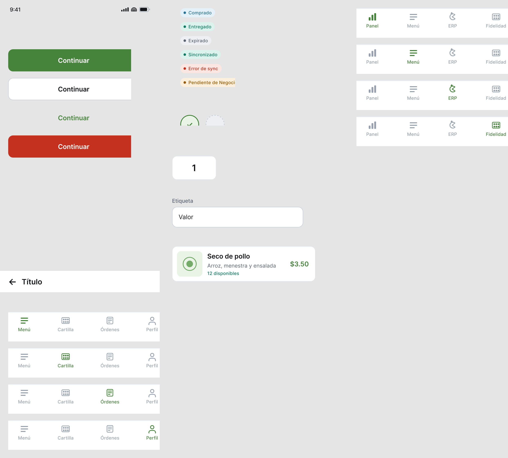

---

## Estudiante

Quien pide y paga el almuerzo. Se autentica con su cuenta institucional.

### Login institucional

Acceso exclusivo con cuenta institucional mediante Google OAuth. No hay registro con correo y contraseña.

**Caso de uso:** UC1, UC1a

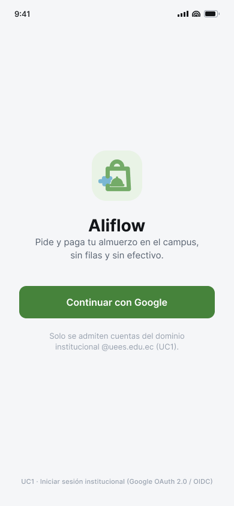{width=30%}

### Elegir establecimiento

Selección obligatoria antes de operar: el saldo y la cartilla pertenecen a cada local por separado, y de esta elección dependen el menú, el saldo y la cartilla que se muestran.

**Caso de uso:** UC1b

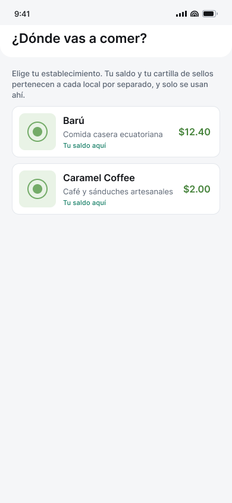{width=30%}

### Menú del día

Menú del establecimiento activo, con el saldo rotulado con su nombre. La disponibilidad se muestra como *Disponible* o *Agotado*, nunca como cantidad de unidades.

**Caso de uso:** UC3, UC3a

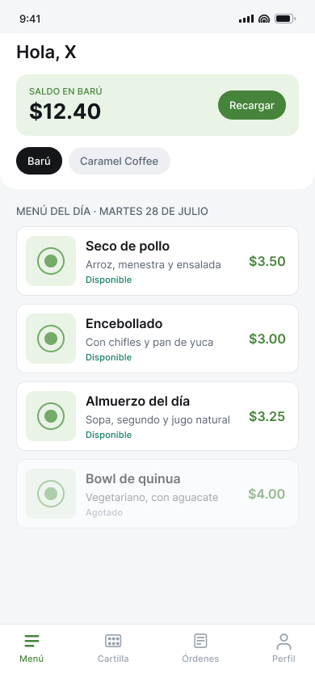{width=30%}

### Detalle y confirmación de compra

Antes de confirmar se revalidan el saldo de ese local y el cupo reservado. El mensaje de saldo insuficiente nombra el establecimiento.

**Caso de uso:** UC4, UC4a

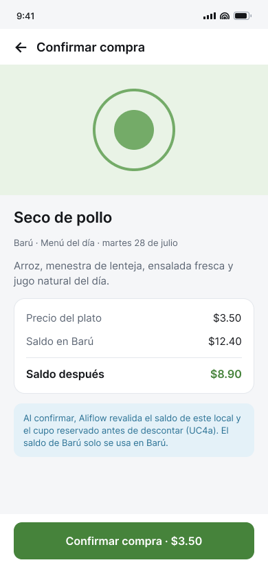{width=30%}

### Compra confirmada y código

Código numérico de 6 dígitos, sin QR, que el estudiante dicta de viva voz. Se acompaña de la hora máxima de retiro del local.

**Caso de uso:** UC5

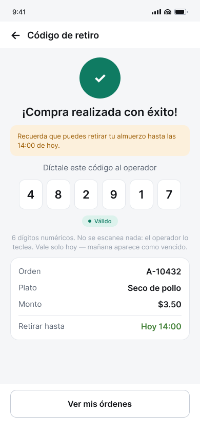{width=30%}

### Recargar saldo

La recarga es contra un establecimiento concreto. Se advierte que el saldo solo puede usarse ahí y que el dinero va directo a la cuenta del proveedor.

**Caso de uso:** UC2, UC2a

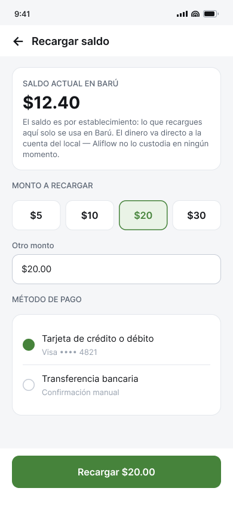{width=30%}

### Historial de órdenes

Estados Comprado, Entregado y Expirado. Las órdenes de canje aparecen con su descuento identificado, no como venta de importe cero.

**Caso de uso:** UC11

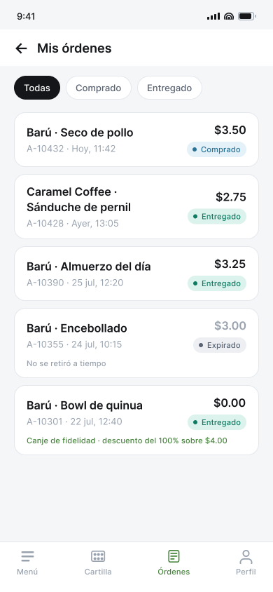{width=30%}

### Cartilla de fidelidad

Una cartilla por establecimiento, con los sellos acumulados sobre los requeridos y el premio ofrecido.

**Caso de uso:** UC13

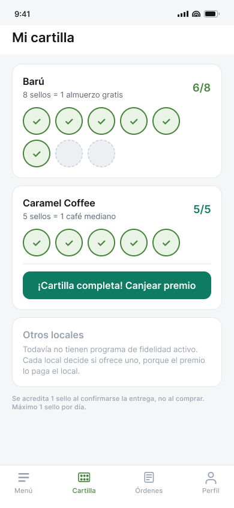{width=30%}

### Canjear premio

El canje muestra el precio del plato, el descuento del 100% rotulado como premio y el total en cero. Descuenta cupo pero no saldo.

**Caso de uso:** UC15

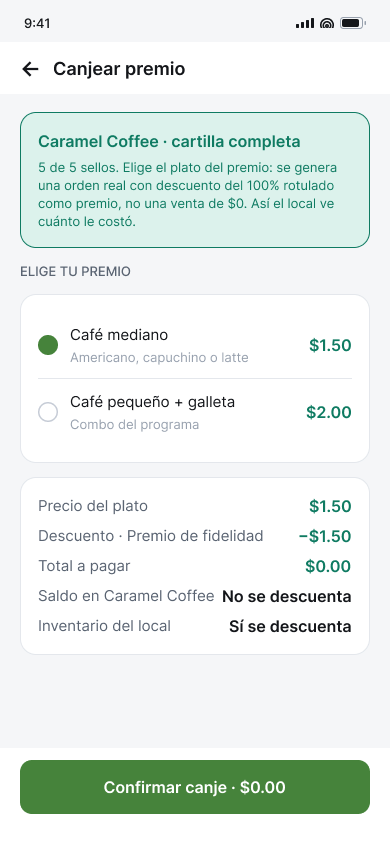{width=30%}

---

## Proveedor

El gerente del establecimiento: administra su menú, su cupo y su personal.

### Login operativo

Credenciales propias del rol, no autenticación institucional.

**Caso de uso:** UC6

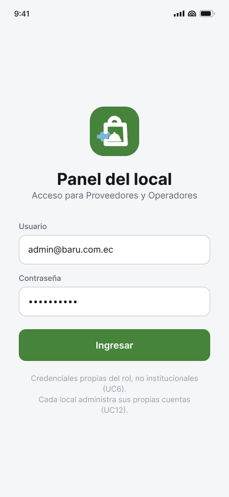{width=30%}

### Panel de métricas

Vendidos, ingresos, pendientes de entrega y platos más vendidos, solo de su establecimiento.

**Caso de uso:** UC9

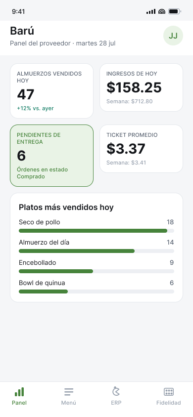{width=30%}

### Menú y cupo de Aliflow

El cupo reservado para Aliflow se muestra separado del stock del ERP, como dos cifras distintas. Incluye la hora máxima de retiro, configurable por local.

**Caso de uso:** UC8, UC16, UC17

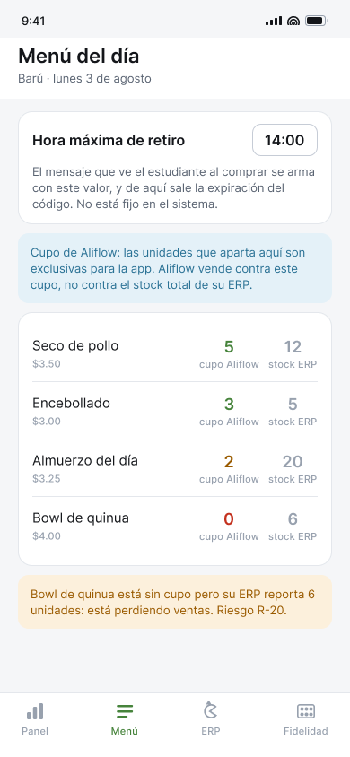{width=30%}

### Estado de sincronización con el ERP

Cola de eventos pendientes y fallidos con sus reintentos. La lectura del ERP es por consulta periódica.

**Caso de uso:** UC10

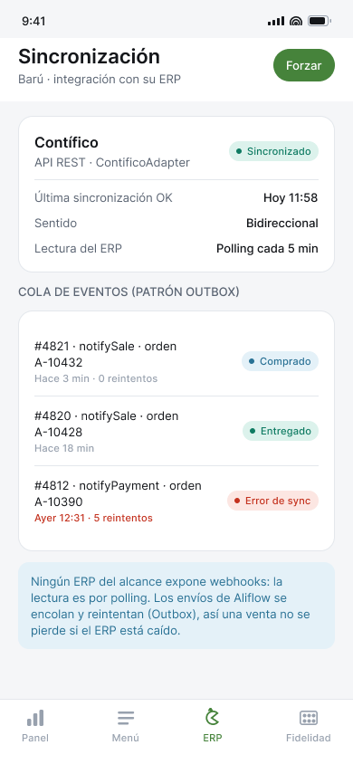{width=30%}

### Configurar el programa de fidelidad

Sellos requeridos, premio, tope diario y caducidad son configuración de cada local, no constantes del sistema.

**Caso de uso:** UC14

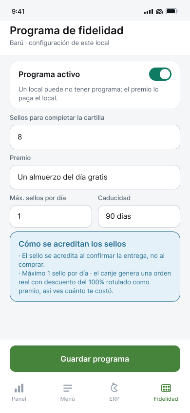{width=30%}

---

## Operador

Valida el código y marca la entrega física en el punto de entrega.

### Login del operador

Credenciales de rol y punto de entrega asignado.

**Caso de uso:** UC6

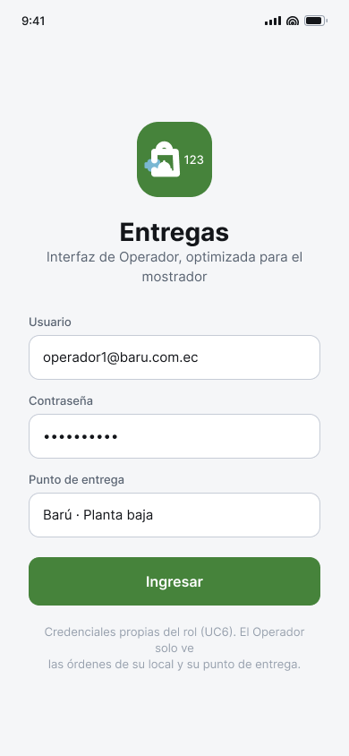{width=30%}

### Validar código de retiro

El operador teclea los 6 dígitos en un teclado numérico. No hay lector de códigos en ninguna parte del sistema.

**Caso de uso:** UC5a

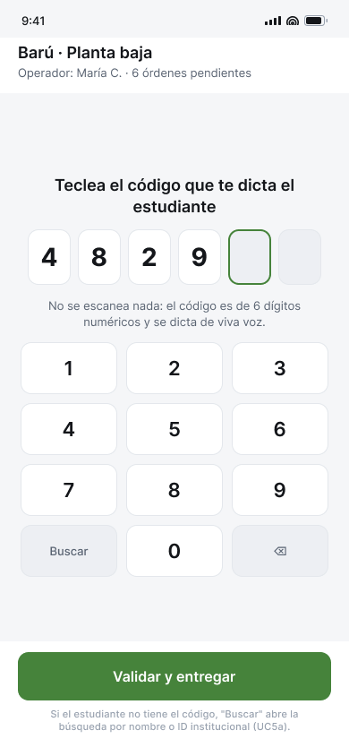{width=30%}

### Entrega confirmada

La orden pasa a Entregada, el código queda invalidado y se acredita el sello de fidelidad.

**Caso de uso:** UC5b, UC5d

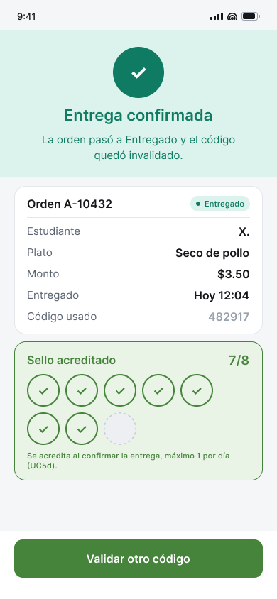{width=30%}

### Código inválido o ya utilizado

Un código ya usado informa la hora de la entrega previa, para distinguirlo de un código inexistente.

**Caso de uso:** UC5c

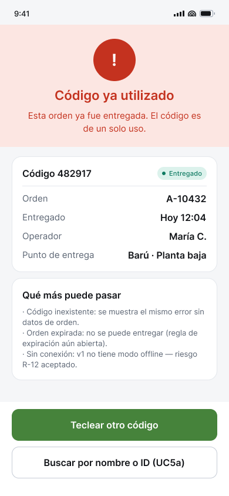{width=30%}

### Código vencido

Tercer estado del código: valía únicamente el día de la compra. Es un caso distinto de inválido y de ya utilizado.

**Caso de uso:** UC5c

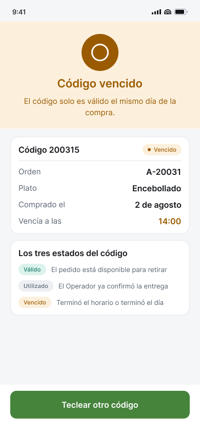{width=30%}

---

## Super-Admin de Aliflow

Administrador de la plataforma. Es el único rol con visibilidad sobre todos los establecimientos.

### Login del Super-Admin

Acceso reservado al equipo de Aliflow, no a ningún establecimiento.

**Caso de uso:** UC6

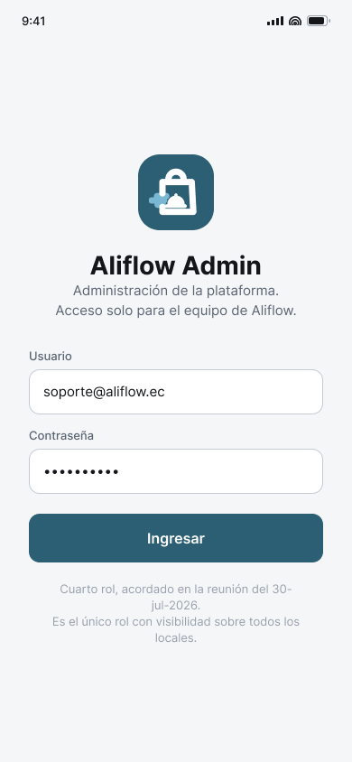{width=30%}

### Locales de la plataforma

Alta de un establecimiento nuevo con su vista de proveedor, y activación o desactivación de los existentes.

**Caso de uso:** UC18, UC20

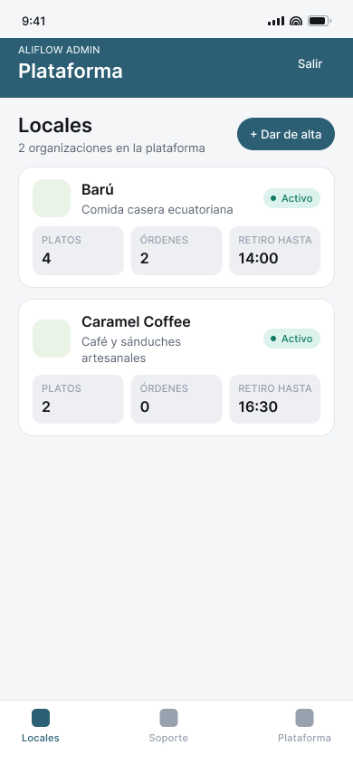{width=30%}

### Soporte

Vista transversal de todos los establecimientos: incidencias de sincronización y órdenes vencidas.

**Caso de uso:** UC19

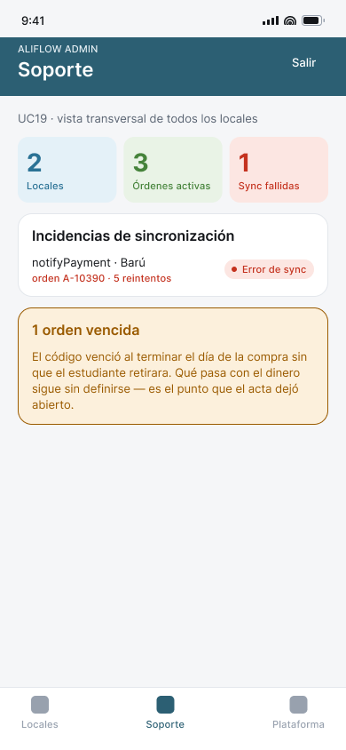{width=30%}

---

## Limitaciones conocidas

- **El prototipo interactivo no tiene backend.** Todo el estado vive en memoria del navegador y se pierde al recargar: no hay base de datos, ni ERP, ni pagos reales.
- **Los datos son de ejemplo** —nombres de platos, montos, órdenes— y las fotos de platos son marcadores de posición.
- **No hay pantallas para la configuración de la integración con el ERP ni para la gestión de usuarios del local**: la primera es trabajo técnico, no una pantalla de autoservicio.
- **No hay pantallas de la pasarela de pagos**, porque la experiencia de pago depende de la pasarela que se seleccione.
