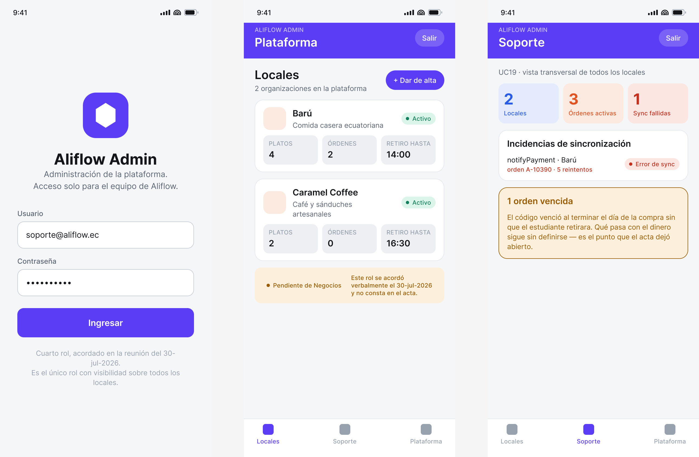

# Aliflow

Plataforma multi-tenant para pedir y pagar el almuerzo dentro del campus. Cada local ("Barú", "Caramel Coffee", …) trae su propio ERP, y Aliflow se integra con todos a través de una API genérica.

Proyecto de **Ingeniería de Software I** — UEES.

---

## ▶️ Prototipo interactivo

**https://jesus-jb.github.io/aliflow/**

Se abre en el navegador, no hay que descargar ni instalar nada. Es una app funcional, no imágenes: hay un selector de rol arriba a la derecha y los **cuatro roles** comparten el mismo estado.

**Recorrido sugerido (2 minutos):**

1. Como **Estudiante**, compra un plato → se descuenta el saldo, se consume el cupo reservado y aparece la confirmación con **hasta qué hora puedes retirar**, más un código de 6 dígitos.
2. Cambia a **Operador**, teclea ese mismo código → la orden pasa a *Entregada* y se acredita un sello.
3. Vuelve a **Estudiante → Cartilla** → verás el sello nuevo llenándose.
4. Vuelve a **Operador** y teclea el mismo código otra vez → *Código ya utilizado*. Teclea **200315** → *Código vencido*, el tercer estado.
5. Como **Proveedor → Menú**, verás el **cupo de Aliflow** separado del stock del ERP, y la hora de retiro configurable.
6. Como **Super-Admin**, verás los locales de toda la plataforma y podrás dar de alta uno nuevo.
7. El botón **Reiniciar demo** (abajo) restaura todo para volver a empezar.

Credenciales ya precargadas en los formularios de Proveedor y Operador.

---

## 🎨 Mockups

Diseño aprobado del que salió el prototipo. Archivo fuente en Figma: [Aliflow · Mockups v2](https://www.figma.com/design/nIaVLcvVdibWfoBqWmJ4Tt). Detalle de cada pantalla en **[Mockups-Prototipo.md](Mockups-Prototipo.md)**.

### Estudiante


### Proveedor


### Operador


### Super-Admin de Aliflow


> El color amarillo con la etiqueta **"Pendiente de Negocios"** marca lo que Ingeniería propuso pero el cliente todavía no validó. Es la misma convención que el estereotipo `<<propuesta>>` de los diagramas UML.

---

## 📚 Documentación

Por dónde empezar, en este orden:

| Documento | Qué contiene |
|---|---|
| **[Decisiones-Pendientes-Negocios.md](Decisiones-Pendientes-Negocios.md)** | Qué está decidido, qué sigue abierto y qué cambió en el diseño como consecuencia. **Es la fuente de verdad del estado del proyecto.** |
| **[Hallazgos-Ingenieria-API-Generica.md](Hallazgos-Ingenieria-API-Generica.md)** | Investigación de la integración con ERPs: comparación, patrón Adapter y patrón Outbox. |
| **[Gestion-de-Riesgos.md](Gestion-de-Riesgos.md)** | 20 riesgos. R-18 (contradicción entre custodia de fondos y saldo único) es el único que puede obligar a rehacer diseño. |
| **[Mockups-Prototipo.md](Mockups-Prototipo.md)** | Las 21 pantallas mapeadas a sus casos de uso. |
| **[uml/](uml/)** | Casos de uso, clases, objetos, componentes, despliegue, actividad, secuencia y estado. Cada `.puml` tiene su `.svg` y su documentación. |
| **[demo-odoo/](demo-odoo/)** | Demo funcional en Docker con Odoo Community, adaptador en Python y pruebas reales de concurrencia. |

### Decisiones de diseño que conviene conocer

- **Cuatro roles:** Estudiante, Proveedor y Operador operan dentro de un local; el **Super-Admin** es de Aliflow y es el único con visibilidad sobre todos.
- **Inventario reservado:** cada local aparta un cupo exclusivo para Aliflow. La app vende contra ese cupo, no contra el stock del ERP — así deja de competir con la caja por el mismo dato y la sobreventa se elimina por diseño.
- **Un solo saldo:** el estudiante recarga una vez; Aliflow reparte internamente por local.
- **Código de retiro numérico de 6 dígitos:** se dicta de viva voz y el Operador lo teclea. No hay QR ni escáner. Vale **solo el día de la compra**.
- **Concurrencia en la base de datos de Aliflow, no en el ERP:** validado empíricamente en el demo, ver `demo-odoo/README.md` sección 7.

> ⚠️ **Decisión abierta que bloquea el modelo de billetera:** el acta del 30-jul dice que el dinero va directo a la cuenta de cada proveedor y que Aliflow no custodia fondos; la decisión #4 define un saldo único gastable en cualquier local. Al recargar todavía no se sabe dónde se comprará. Ver `Decisiones-Pendientes-Negocios.md`, punto 13.

---

## 🔧 Correr el prototipo localmente

Solo hace falta si vas a modificarlo; para verlo basta el enlace de arriba.

```bash
cd mockups/prototipo-web
npm install
npm run dev
```

Cada push a `main` que toque `mockups/prototipo-web/` vuelve a compilar y publicar el sitio automáticamente ([flujo de despliegue](.github/workflows/deploy-prototipo.yml)).
