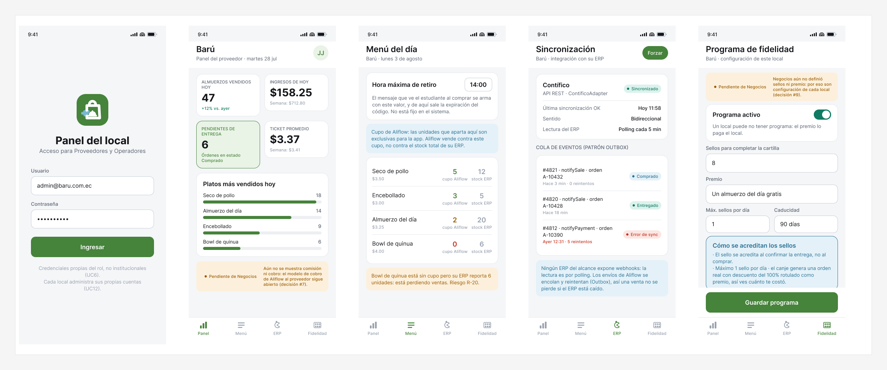
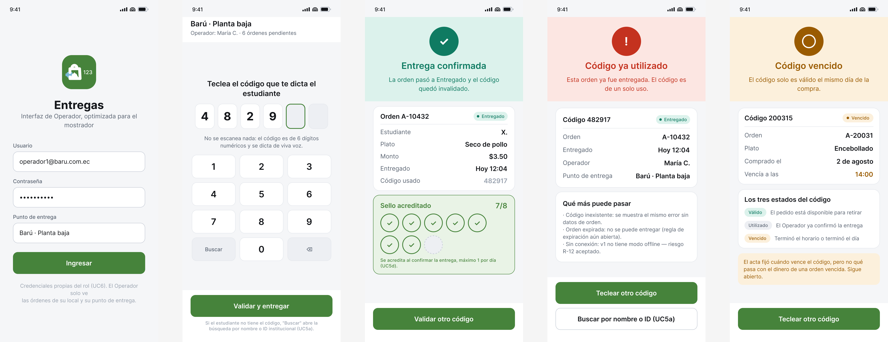
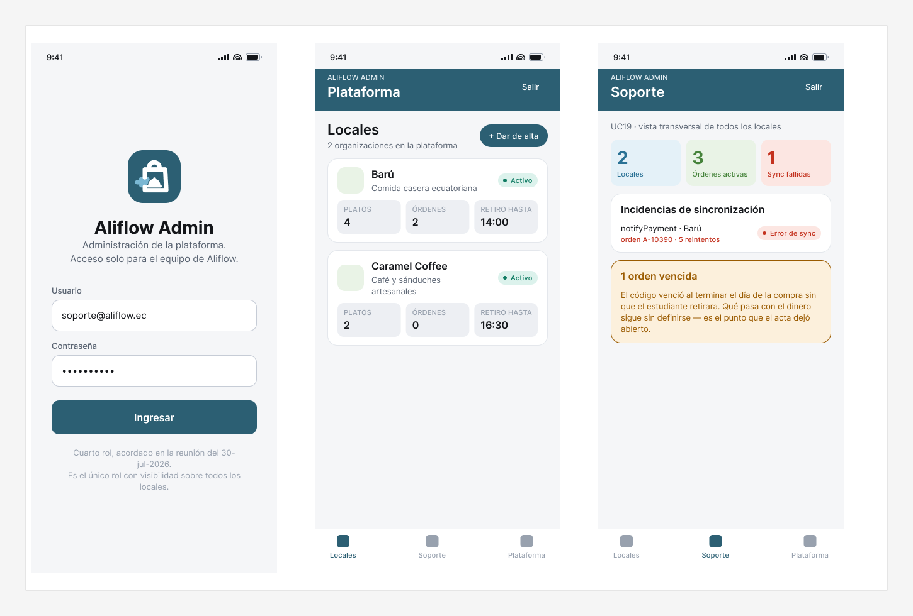

# Aliflow

Plataforma multi-tenant para pedir y pagar el almuerzo dentro del campus. Cada local ("Barú", "Caramel Coffee", …) trae su propio ERP, y Aliflow se integra con todos a través de una API genérica.

Proyecto de **Ingeniería de Software I** — UEES.

---

## ▶️ Prototipo interactivo

**https://jesus-jb.github.io/aliflow/**

Se abre en el navegador, no hay que descargar ni instalar nada. Es una app funcional, no imágenes: hay un selector de rol arriba a la derecha y los **cuatro roles** comparten el mismo estado.

**Recorrido sugerido (2 minutos):**

1. Como **Estudiante**, lo primero es **elegir establecimiento** — el saldo pertenece al local, no a tu cuenta. Elige **Barú** y compra un plato → se descuenta el saldo *de Barú*, se consume el cupo reservado y aparece la confirmación con **hasta qué hora puedes retirar**, más un código de 6 dígitos.
   > Fíjate en que el menú dice solo **Disponible** o **Agotado**: al estudiante nunca se le muestra cuántas unidades quedan.
2. Cambia a **Operador**, teclea ese mismo código → la orden pasa a *Entregada* y se acredita un sello.
3. Vuelve a **Estudiante → Cartilla** → verás el sello nuevo llenándose.
4. Vuelve a **Operador** y teclea el mismo código otra vez → *Código ya utilizado*. Teclea **200315** → *Código vencido*, el tercer estado.
5. Como **Proveedor → Menú**, verás el **cupo de Aliflow** separado del stock del ERP, y la hora de retiro configurable.
6. Como **Super-Admin**, verás los locales de toda la plataforma y podrás dar de alta uno nuevo.
7. Cambia a **Caramel Coffee** e intenta comprar el sánduche de $2.75: **no te deja**, aunque tengas $12.40 en Barú. Ese es el costo del saldo por establecimiento, registrado como riesgo R-21.
8. El botón **Reiniciar demo** (abajo) restaura todo para volver a empezar.

Credenciales ya precargadas en los formularios de Proveedor y Operador.

---

## 🎨 Mockups

Diseño aprobado del que salió el prototipo. La identidad visual sale del logo de Aliflow (verde `#74AB68`, azul `#7AB7D3`) — ver **[mockups/marca/](Entregables/mockups/marca/)** para la paleta completa y por qué el verde del logo no se usa en botones. Archivo fuente en Figma: [Aliflow · Mockups v2](https://www.figma.com/design/nIaVLcvVdibWfoBqWmJ4Tt). Detalle de cada pantalla en **[Mockups-Prototipo.md](Entregables/markdown/01-Especificacion-de-Requerimientos/Apendice-A-Prototipo.md)**.

### Estudiante


### Proveedor


### Operador


### Super-Admin de Aliflow


> El color amarillo con la etiqueta **"Pendiente de Negocios"** marca lo que Ingeniería propuso pero el cliente todavía no validó. Es la misma convención que el estereotipo `<<propuesta>>` de los diagramas UML.

---

## 📚 Documentación

Por dónde empezar, en este orden:

| Documento | Qué contiene |
|---|---|
| **[Estado-del-Proyecto.md](Estado-del-Proyecto.md)** | **Empezá acá si te estás sumando al proyecto.** Qué está hecho, qué falta, qué está bloqueado, y las trampas que ya costaron tiempo (para no repetirlas). |
| **[Entregables/](Entregables/)** | **Todo lo que se entrega.** Un PDF por punto del enunciado para ver qué falta, los 5 documentos oficiales en `Documento Oficial/`, y las fuentes en `markdown/`. |
| **[Decisiones-Pendientes-Negocios.md](Decisiones-Pendientes-Negocios.md)** | Qué está decidido, qué sigue abierto y qué cambió en el diseño como consecuencia. **Es la fuente de verdad del estado del proyecto.** |
| **[Hallazgos-Ingenieria-API-Generica.md](Hallazgos-Ingenieria-API-Generica.md)** | Investigación de la integración con ERPs: comparación, patrón Adapter y patrón Outbox. |
| **[Gestión de riesgos](Entregables/markdown/01-Especificacion-de-Requerimientos/06-Gestion-de-Riesgos.md)** | 23 riesgos. R-18 y R-19 se cerraron el 8-ago con la decisión de recarga por establecimiento; esa misma decisión abrió R-21 (saldo fragmentado), R-22 y R-23. |
| **[Detalle del prototipo](Entregables/markdown/01-Especificacion-de-Requerimientos/Apendice-A-Prototipo.md)** | Las 22 pantallas mapeadas a sus casos de uso. |
| **[Entregables/uml/](Entregables/uml/)** | Los 20 diagramas: casos de uso, clases, objetos, componentes, despliegue, actividad, secuencia y estado. Cada `.puml` tiene su `.svg`; su documentación está en [`Entregables/markdown/`](Entregables/markdown/). |
| **[demo-odoo/](demo-odoo/)** | Demo funcional en Docker con Odoo Community, adaptador en Python y pruebas reales de concurrencia. |

### Decisiones de diseño que conviene conocer

- **Cuatro roles:** Estudiante, Proveedor y Operador operan dentro de un local; el **Super-Admin** es de Aliflow y es el único con visibilidad sobre todos.
- **Inventario reservado:** cada local aparta un cupo exclusivo para Aliflow. La app vende contra ese cupo, no contra el stock del ERP — así deja de competir con la caja por el mismo dato y la sobreventa se elimina por diseño.
- **Saldo por establecimiento:** el estudiante recarga *para un local* y ese saldo solo se gasta ahí. El dinero va directo a la cuenta del proveedor — **Aliflow no custodia fondos en ningún momento**. El modelo de referencia lo dio el cliente: la app de Parqueo Positivo, donde eliges un servicio por defecto y el saldo pertenece a ese servicio.
- **Código de retiro numérico de 6 dígitos:** se dicta de viva voz y el Operador lo teclea. No hay QR ni escáner. Vale **solo el día de la compra**.
- **Al estudiante no se le muestra la cantidad disponible**, solo si el plato está *Disponible* o *Agotado*. El número del cupo es un acuerdo interno entre el local y Aliflow.
- **Concurrencia en la base de datos de Aliflow, no en el ERP:** validado empíricamente en el demo, ver `demo-odoo/README.md` sección 7.

> ✅ **La decisión que bloqueaba el modelo de billetera se cerró el 8-ago-2026.** Había una contradicción entre el acta (el dinero va directo a cada proveedor, Aliflow no custodia fondos) y la decisión #4 (saldo único gastable en cualquier local): al recargar todavía no se sabía dónde se compraría. Negocios resolvió que **la recarga es por establecimiento**. Con eso el modelo de datos queda desbloqueado por completo. El costo es la fragmentación del saldo entre locales, registrada como riesgo R-21. Ver `Decisiones-Pendientes-Negocios.md`, punto 13.
>
> **Propagado el 9-ago-2026** al diagrama de clases, al prototipo en vivo y a los mockups de Figma.

---

## 📄 Regenerar los PDF de entrega

Los PDF de `Entregables/` **no se editan a mano**: son salida de los `.md` de `Entregables/markdown/`.

```bash
cd Entregables
./build/construir.sh                # los 19 individuales + los 5 oficiales
./build/construir.sh oficiales      # solo lo que se entrega
```

Requiere `pandoc` y `typst`. **Hay que recompilar cada vez que cambie una fuente**, o el PDF entregado deja de coincidir con ella.

---

## 🔧 Correr el prototipo localmente

Solo hace falta si vas a modificarlo; para verlo basta el enlace de arriba.

```bash
cd Entregables/mockups/prototipo-web
npm install
npm run dev
```

Cada push a `main` que toque `Entregables/mockups/prototipo-web/` vuelve a compilar y publicar el sitio automáticamente ([flujo de despliegue](.github/workflows/deploy-prototipo.yml)).
