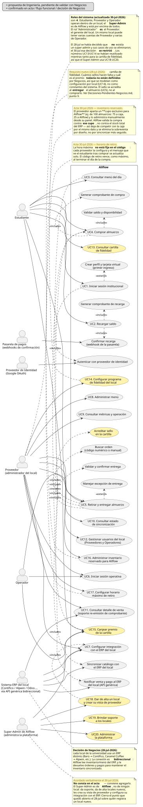

# Documentación de Casos de Uso — Aliflow

**Diagrama fuente:** `casos-de-uso.puml` (mismo directorio) — es la fuente editable; `casos-de-uso.svg` es la imagen renderizada que se muestra arriba (generada con el servidor público de PlantUML). Si editas el `.puml`, regenera el SVG para que la imagen quede sincronizada — instrucciones en `README-diagramas.md`.

**Referencia:** cada caso de uso indica el paso correspondiente de `Flujos-Aliflow-Revision.html` (formato `{rol}-{número}`, ver nota en `Hallazgos-Ingenieria-API-Generica.md` sección 5) del que se derivó.

**Convención visual (revisión 27-jul-2026):** UC12, UC13 y UC14 (asociados al actor Administrador) aparecen ahora con fondo amarillo en el diagrama — marca que son propuesta de Ingeniería sin validar con Negocios, no casos de uso confirmados. Misma convención usada en `diagrama-clases.puml` y `diagrama-componentes.puml`.

## Actores

| Actor | Tipo | Descripción |
|---|---|---|
| **Estudiante** | Primario | Usuario institucional que recarga saldo, consulta el menú, compra y retira almuerzos. |
| **Proveedor** | Primario | Administra el menú, inventario y métricas de su negocio dentro de Aliflow. En la práctica, corresponde a Barú (cafetería de la UEES) — ver `Hallazgos-Ingenieria-API-Generica.md` sección 4.3. |
| **Operador** | Primario | Valida compras y entrega físicamente el almuerzo en el punto de entrega. Equivalente al rol "cajero" usado en discusiones previas del equipo. |
| **Administrador** | Primario | Super-admin de la plataforma Aliflow — **distinto del Proveedor** (confirmado 26-jul-2026). Gestiona la plataforma en sí (altas de proveedores, usuarios/roles, métricas globales), no el negocio de un proveedor específico. **Su alcance detallado (UC12-UC14) es una propuesta inicial de Ingeniería, no está validado formalmente con Negocios todavía** — ver nota en el diagrama. |
| **Proveedor de Identidad (Google OAuth)** | Secundario / sistema externo | Autentica al Estudiante mediante OAuth 2.0 / OpenID Connect. |
| **Sistema ERP del Proveedor** | Secundario / sistema externo | En la práctica, **Alpwin** (el sistema que Barú ya usa, sin API pública conocida — ver sección 4.3 del hallazgo de Ingeniería). Odoo/Contífico quedan como alternativas de arquitectura ya validadas (demo) o recomendadas a futuro, conectadas vía la API genérica (patrón Adapter, ver `Hallazgos-Ingenieria-API-Generica.md` sección 3). |

> **Nota:** el acta y el flujo dejan pendiente si un mismo Proveedor puede tener varios usuarios con permisos distintos ("personal autorizado", `prov-1`). Este modelo no lo asume todavía — se documenta como pendiente en el hallazgo de Ingeniería, no se modela como actor separado hasta que Negocios lo defina.

---

## UC1 — Iniciar sesión institucional

| Campo | Detalle |
|---|---|
| **Actor primario** | Estudiante |
| **Actor secundario** | Proveedor de Identidad (Google OAuth) |
| **Referencia** | `est-1` — Autenticación |
| **Precondición** | El estudiante posee un correo institucional válido en el dominio autorizado. |
| **Flujo principal** | 1. El estudiante selecciona "Iniciar sesión con Google". 2. El sistema redirige al proveedor de identidad y solicita consentimiento (`<<include>>` UC1a). 3. El backend valida que el dominio del correo pertenezca a la lista institucional autorizada y que el token no esté expirado. 4. Se genera una sesión autenticada (token/JWT). |
| **Flujo alternativo (extend)** | **UC1b — Crear perfil y tarjeta virtual:** si es el primer ingreso del estudiante, se crea su perfil y tarjeta virtual con saldo en cero antes de continuar. |
| **Excepción** | Si el dominio del correo no pertenece a la lista institucional autorizada, se rechaza el acceso (validación crítica marcada en el flujo). |
| **Postcondición** | El estudiante queda autenticado con una sesión válida. |

## UC2 — Recargar saldo

| Campo | Detalle |
|---|---|
| **Actor primario** | Estudiante |
| **Referencia** | `est-2` — Recarga de tarjeta virtual |
| **Precondición** | El estudiante está autenticado (UC1). |
| **Flujo principal** | 1. El estudiante selecciona "Recargar saldo" e ingresa un monto (o elige uno predefinido). 2. Se redirige al método de recarga definido por el negocio. 3. Al confirmarse el pago, el sistema actualiza el saldo (operación atómica) e incluye la generación del comprobante (`<<include>>` UC2a). 4. El estudiante ve su saldo actualizado. |
| **Postcondición** | El saldo del estudiante queda incrementado; existe un comprobante de recarga asociado. |
| **Pendiente (no bloquea el caso de uso, pero afecta su diseño de datos)** | Si el saldo es único distribuido internamente o independiente por proveedor/tenant — decisión abierta documentada en `Hallazgos-Ingenieria-API-Generica.md` sección 5.2. |

## UC3 — Consultar menú del día

| Campo | Detalle |
|---|---|
| **Actor primario** | Estudiante |
| **Actor secundario** | Sistema ERP del Proveedor |
| **Referencia** | `est-3` — Consulta del menú del día |
| **Precondición** | El estudiante está autenticado. |
| **Flujo principal** | 1. El estudiante accede a "Menú del día". 2. El sistema sincroniza/consulta el catálogo del proveedor (`<<include>>` UC3a), vía la API genérica o una base local ya sincronizada. 3. Se muestra el menú con disponibilidad actualizada. |
| **Excepción** | Si no hay sincronización en tiempo real, puede presentarse el caso "vendido antes de confirmar" al momento de la compra (ver UC4). |
| **Postcondición** | El estudiante visualiza platos disponibles, precio y stock. |

## UC4 — Comprar almuerzo

| Campo | Detalle |
|---|---|
| **Actor primario** | Estudiante |
| **Actor secundario** | Sistema ERP del Proveedor |
| **Referencia** | `est-4` — Compra del almuerzo |
| **Precondición** | El estudiante consultó el menú (UC3) y tiene saldo disponible. |
| **Flujo principal** | 1. El estudiante selecciona un plato y confirma la compra. 2. El sistema valida saldo y disponibilidad (`<<include>>` UC4a, con revalidación de stock justo antes de confirmar). 3. Si ambas validaciones pasan: se descuenta el saldo (atómico), se crea la orden en estado "Comprado", se genera el comprobante (`<<include>>` UC4b) y se notifica al proveedor (`<<include>>` UC4c). |
| **Flujo alternativo** | Si falla alguna validación (saldo o stock insuficiente), se muestra el error y no se ejecuta ningún descuento. |
| **Excepción crítica** | Concurrencia: dos estudiantes no deben poder comprar la última unidad simultáneamente — requiere bloqueo/transacción atómica (ya identificado como riesgo). |
| **Postcondición** | Orden creada en estado "Comprado"; saldo y stock descontados; comprobante generado; ERP del proveedor notificado. |

## UC5 — Retirar y entregar almuerzo

| Campo | Detalle |
|---|---|
| **Actor primario** | Estudiante y Operador (caso de uso compartido — ambos participan de la misma transacción) |
| **Referencia** | `est-6` (Estudiante) y `op-2`/`op-3`/`op-4`/`op-5` (Operador) |
| **Precondición** | Existe una orden en estado "Comprado" (UC4). |
| **Flujo principal** | 1. El estudiante se presenta en el punto de entrega con su código de validación. 2. El operador busca la orden (`<<include>>` UC5a — por código o búsqueda manual por nombre/ID institucional si el estudiante no tiene el código). 3. El sistema valida y confirma la entrega (`<<include>>` UC5b): verifica que el estado sea "Comprado" (no "Entregado"), cambia el estado a "Entregado", registra timestamp y operador, e invalida el código (uso único). |
| **Flujo alternativo (extend)** | **UC5c — Manejar excepción de entrega:** código inválido/ya usado (mensaje de error con hora de entrega previa), o fallo de conexión (v1 no tiene modo offline — riesgo ya documentado). |
| **Postcondición** | Orden en estado "Entregado"; código invalidado. |
| **Pendiente** | Formato del código (QR/numérico) — decisión abierta que bloquea el prototipo de mockups (sección 5.2 del hallazgo de Ingeniería). Estado de "no retiro"/expiración de orden no está definido (sección 5.3). |

## UC6 — Iniciar sesión operativa

| Campo | Detalle |
|---|---|
| **Actor primario** | Proveedor, Operador |
| **Referencia** | `prov-1`, `op-1` |
| **Precondición** | El usuario tiene una cuenta con el rol correspondiente ya asignada (no es OAuth institucional, son credenciales propias del rol). |
| **Flujo principal** | 1. El usuario inicia sesión con sus credenciales de rol. 2. El sistema valida el rol y da acceso a la interfaz correspondiente (panel de administración para Proveedor; interfaz simplificada optimizada para uso rápido en el caso de Operador). |
| **Postcondición** | Sesión autenticada con permisos del rol correspondiente. |

## UC7 — Configurar integración con sistema externo

| Campo | Detalle |
|---|---|
| **Actor primario** | Proveedor (junto con Ingeniería) |
| **Actor secundario** | Sistema ERP del Proveedor |
| **Referencia** | `prov-2` |
| **Precondición** | El proveedor está dado de alta en Aliflow; su ERP (Odoo, Contífico, u otro) ya fue identificado. |
| **Flujo principal** | 1. Se especifica el endpoint/mecanismo de conexión del ERP. 2. Se define el mapeo de datos (productos, precios, stock) al modelo canónico de Aliflow. 3. La API genérica (patrón Adapter) actúa como capa de abstracción, sin que el resto de Aliflow dependa de la implementación específica del ERP. |
| **Postcondición** | El adaptador correspondiente (`OdooAdapter`, `ContificoAdapter`, etc.) queda configurado y operativo para ese proveedor. |
| **Nota de arquitectura** | Este caso de uso es la materialización directa del reto técnico investigado en `Hallazgos-Ingenieria-API-Generica.md` — ver secciones 3 y 4.2 (demo validado con Odoo Community). |

## UC8 — Administrar menú

| Campo | Detalle |
|---|---|
| **Actor primario** | Proveedor |
| **Referencia** | `prov-3` |
| **Precondición** | El proveedor está autenticado (UC6). |
| **Flujo principal** | 1. El proveedor define el menú del día (plato, descripción, precio, stock inicial), manualmente o sincronizado desde su ERP. 2. El sistema valida datos mínimos (precio > 0, nombre no vacío, stock ≥ 0) antes de publicar. |
| **Postcondición** | Menú publicado y disponible para consulta (UC3). |

## UC9 — Consultar métricas y operación

| Campo | Detalle |
|---|---|
| **Actor primario** | Proveedor |
| **Referencia** | `prov-5` |
| **Precondición** | El proveedor está autenticado. |
| **Flujo principal** | 1. El proveedor accede a su panel de métricas. 2. El sistema calcula y muestra: almuerzos vendidos por día/semana, ingresos, platos más vendidos, y órdenes "Comprado" pendientes de "Entregado", a partir del histórico de órdenes de Aliflow. |
| **Postcondición** | El proveedor visualiza el estado operativo de su negocio. |
| **Pendiente** | Modelo de cobro de Aliflow al proveedor (comisión/suscripción) — decisión abierta, sección 5.2 del hallazgo de Ingeniería. |

## UC10 — Consultar estado de sincronización

| Campo | Detalle |
|---|---|
| **Actor primario** | Proveedor |
| **Referencia** | `prov-4` |
| **Precondición** | El proveedor tiene su integración configurada (UC7). |
| **Flujo principal** | 1. El proveedor consulta el estado de sincronización de inventario en su panel. 2. El sistema muestra la última comunicación exitosa con su ERP y eventos pendientes/fallidos (tabla de reconciliación, ver arquitectura outbox en `Hallazgos-Ingenieria-API-Generica.md` sección 3.4). |
| **Postcondición** | El proveedor conoce si hay ventas pendientes de reflejarse en su ERP externo. |

## UC11 — Consultar detalle de venta (soporte re-emisión de comprobante)

| Campo | Detalle |
|---|---|
| **Actor primario** | Proveedor |
| **Actor secundario** | Sistema ERP del Proveedor |
| **Referencia** | `prov-6` |
| **Precondición** | Existen ventas registradas en Aliflow (UC4). |
| **Flujo principal** | 1. El proveedor consulta o descarga el detalle de una venta (monto, plato, estudiante, fecha/hora) desde Aliflow. 2. El proveedor re-emite la factura válida en su propio sistema contable/ERP, usando ese detalle como fuente de datos. |
| **Postcondición** | El proveedor cuenta con la información necesaria para emitir su factura fiscal real; Aliflow nunca emite un comprobante con validez tributaria. |
| **Nota importante** | Este es el caso de uso donde se detectó la contradicción entre el Acta (25-jun-2026) y el flujo documentado respecto al comprobante tributario — ver `Hallazgos-Ingenieria-API-Generica.md` sección 5.1. El modelo correcto es el aquí descrito: re-emisión por el proveedor, no emisión fiscal directa de Aliflow. |

## UC12 — Dar de alta / gestionar proveedores

> ⚠️ **Propuesta inicial de Ingeniería, no validada con Negocios.** El rol Administrador se confirmó como distinto del Proveedor, pero su alcance detallado no está definido en ningún acta ni flujo — este caso de uso (y UC13/UC14) son una hipótesis razonable de lo que un super-admin de plataforma necesitaría, para no dejar el actor sin casos de uso en el diagrama. Debe validarse en la siguiente reunión.

| Campo | Detalle |
|---|---|
| **Actor primario** | Administrador |
| **Referencia** | Ninguna aún — no existe en el flujo documentado ni en el acta. |
| **Precondición** | El administrador está autenticado con el rol de plataforma. |
| **Flujo principal** | 1. El administrador registra un nuevo proveedor (tenant) en Aliflow. 2. Define sus datos básicos y, en coordinación con Ingeniería, su integración con el ERP correspondiente (ver UC7). 3. Puede suspender o dar de baja a un proveedor existente. |
| **Postcondición** | El proveedor queda habilitado (o deshabilitado) para operar dentro de Aliflow. |

## UC13 — Consultar métricas globales de la plataforma

| Campo | Detalle |
|---|---|
| **Actor primario** | Administrador |
| **Referencia** | Ninguna aún — propuesta de Ingeniería. |
| **Precondición** | El administrador está autenticado. |
| **Flujo principal** | 1. El administrador consulta métricas agregadas de toda la plataforma (todos los proveedores), no las de un solo tenant como en UC9. 2. El sistema muestra volumen de transacciones, proveedores activos, y estado general de las integraciones. |
| **Postcondición** | El administrador tiene visibilidad del estado global de Aliflow. |
| **Pendiente relacionado** | Depende de que se defina el modelo de cobro de Aliflow a los proveedores (sección 5.2 del hallazgo de Ingeniería) para saber qué métricas de negocio (no solo operativas) debería ver este rol. |

## UC14 — Gestionar usuarios y roles

| Campo | Detalle |
|---|---|
| **Actor primario** | Administrador |
| **Referencia** | Ninguna aún — propuesta de Ingeniería. |
| **Precondición** | El administrador está autenticado. |
| **Flujo principal** | 1. El administrador crea/gestiona cuentas con rol Proveedor u Operador. 2. Puede revocar accesos o restablecer credenciales. |
| **Postcondición** | Los usuarios de la plataforma quedan correctamente habilitados con el rol que les corresponde. |
| **Nota** | Relacionado con el vacío ya detectado en `Hallazgos-Ingenieria-API-Generica.md` sección 5.3 sobre "roles múltiples por proveedor" (`prov-1`) — ambos temas conviene resolverlos juntos con Negocios. |

---

## Casos de uso incluidos/extendidos (sub-flujos reutilizables)

Estos no son procesos de negocio independientes, sino pasos reutilizados dentro de los casos de uso principales (relación `<<include>>`/`<<extend>>` en el diagrama). Se documentan de forma breve:

| ID | Nombre | Incluido/extiende en | Propósito |
|---|---|---|---|
| UC1a | Autenticar con proveedor de identidad | UC1 (include) | Delegar la autenticación en Google OAuth 2.0 / OIDC. |
| UC1b | Crear perfil y tarjeta virtual | UC1 (extend, solo primer ingreso) | Inicializar el perfil del estudiante con saldo en cero. |
| UC2a | Generar comprobante de recarga | UC2 (include) | Emitir constancia sin validez tributaria de la recarga. |
| UC3a | Sincronizar catálogo con sistema del proveedor | UC3 (include) | Obtener platos/precio/stock actualizados vía la API genérica. |
| UC4a | Validar saldo y disponibilidad | UC4 (include) | Revalidar saldo suficiente y stock justo antes de confirmar la compra. |
| UC4b | Generar comprobante de compra | UC4 (include) | Emitir constancia interna sin validez tributaria (ver UC11). |
| UC4c | Notificar venta al sistema del proveedor | UC4 (include) | Descontar stock en el ERP externo vía la API genérica (patrón outbox si falla, ver arquitectura). |
| UC5a | Buscar orden (código o manual) | UC5 (include) | Ubicar la orden por código de validación o por nombre/ID institucional. |
| UC5b | Validar y confirmar entrega | UC5 (include) | Verificar estado, cambiar a "Entregado", invalidar código, registrar timestamp/operador. |
| UC5c | Manejar excepción de entrega | UC5 (extend) | Código inválido/ya usado, o fallo de conectividad (riesgo v1 sin modo offline). |

---

*Documento preparado por el Grupo de Ingeniería como parte del entregable 02.a (Diagramas de casos de uso y documentación completa de cada caso de uso).*
