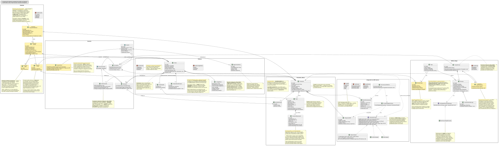

# Documentación del Diagrama de Clases — Aliflow

**Diagrama fuente:** `diagrama-clases.puml` (mismo directorio) — ver `README-diagramas.md` para regenerar el SVG tras editarlo.

Este diagrama modela la **lógica de negocio** del sistema (no las clases de infraestructura/ORM/framework), organizada en 5 paquetes.

**Convención visual (revisión 27-jul-2026):** los elementos con fondo amarillo y estereotipo `<<propuesta>>` son diseño de Ingeniería sin validar todavía con Negocios — no decisiones ya confirmadas. Antes esta distinción solo vivía en este markdown; ahora es visible directamente en el `.svg`, para que no se pueda confundir una propuesta con una decisión cerrada solo mirando la imagen.

---

## 1. Paquete "Usuarios"

Jerarquía de herencia con **`Usuario`** como clase abstracta base (id, nombreCompleto, email, fechaRegistro, activo), especializada en:

- **`Estudiante`** — mapea al actor "Estudiante" de los casos de uso.
- **`Administrador`** — super-admin de la plataforma (actor confirmado como distinto de Proveedor, ver `Hallazgos-Ingenieria-API-Generica.md` y `uml/Documentacion-Casos-de-Uso.md`).
- **`UsuarioProveedor`** (abstracta) — representa a una persona con acceso al panel de un Proveedor específico (`# proveedor: Proveedor`), resolviendo el vacío ya detectado de "personal autorizado múltiple por proveedor" (`prov-1`). Se especializa en:
  - **`Propietario`** — mapea al actor "Proveedor" de los casos de uso (administra menú, ve métricas).
  - **`Cajero`** — mapea al actor "Operador" de los casos de uso (equivalente al rol "cajero" mencionado en discusiones previas del equipo). Asociado a un `PuntoDeEntrega` específico, consistente con la precondición ya documentada ("vinculada a un punto de entrega físico específico").

> **Decisión de diseño propuesta, no validada aún con Negocios:** modelar Cajero/Propietario como subclases de un `UsuarioProveedor` común (en vez de un solo `Usuario` con un campo `rol`) resuelve de una vez el vacío de "roles múltiples por proveedor" detectado en la revisión del flujo. Si Negocios define algo distinto, solo cambia esta jerarquía — el resto del diagrama no se ve afectado.

## 2. Paquete "Proveedor y Menú"

**`Proveedor`** (el tenant/negocio — en la práctica, Barú) agrega su personal (`UsuarioProveedor`), sus puntos de entrega físicos (`PuntoDeEntrega`) y su menú (`Plato`). `Plato.hayStock()` encapsula la validación de disponibilidad que en el flujo se menciona como "revalidación de stock justo antes de confirmar" (`est-4`).

**Control de concurrencia (agregado 27-jul-2026):** `Plato` ahora tiene un campo `version` y un método `reservarStock(cantidad)` — implementa bloqueo optimista para el riesgo ya identificado desde el flujo original ("dos estudiantes no deben poder comprar la última unidad simultáneamente"). Antes este riesgo estaba documentado en prosa pero no tenía ningún elemento correspondiente en el diagrama de clases; el detalle exacto de la transacción se completa en el diagrama de secuencia.

**Validado empíricamente (27-jul-2026, ver `demo-odoo/README.md` sección 7):** se probó implementar este mismo bloqueo directamente contra el ERP externo (Odoo, vía RPC) y falló bajo concurrencia real (5 hilos comprando con 3 unidades de stock vendieron las 5). Esto confirma que `Plato.version`/`reservarStock()` deben vivir en la base de datos propia de Aliflow, no delegarse al ERP — la prueba de concurrencia repetida contra un dominio local con lock real (`demo-odoo/plato_local.py`) sí se comportó correctamente.

## 3. Paquete "Wallet y Pagos"

Modela la decisión de negocio ya confirmada (`Hallazgos-Ingenieria-API-Generica.md`, marco de negocio 2026-07-13): **el saldo es independiente por proveedor**, no una sola bolsa de dinero. Por eso `TarjetaVirtual` no tiene un campo `saldo` directo, sino que agrega múltiples `SaldoProveedor` (uno por cada `Proveedor` con el que el estudiante ha operado).

Lo que sí sigue pendiente de decidir es el **mecanismo de recarga** (¿el estudiante recarga explícitamente por proveedor, o hace una única recarga que Aliflow distribuye internamente?). En vez de bloquear el diseño esperando esa decisión, se modela con el patrón **Strategy**:

- **`EstrategiaDistribucionRecarga`** (interfaz) define `distribuir(monto, tarjeta)`.
- **`RecargaDirectaPorProveedor`** y **`RecargaDistribuidaAutomaticamente`** son dos implementaciones candidatas, una por cada alternativa que Negocios está evaluando.

Así, `Recarga` depende solo de la abstracción (`Recarga ..> EstrategiaDistribucionRecarga`), y cuando se tome la decisión, se activa la implementación correspondiente sin tocar el resto del modelo — ejemplo directo de **Open/Closed** (ver sección SOLID).

`Pago` (con `EstadoPago`: APROBADO/PENDIENTE/RECHAZADO — tal como se encontró en la investigación previa del equipo sobre el flujo de pagos) genera una `Recarga` solo si es aprobado. `ComprobanteRecarga` es el comprobante interno sin validez tributaria ya documentado (`est-2`).

## 4. Paquete "Órdenes"

**`Orden`** agrega una o más `OrdenDetalle` (plato + cantidad + precio unitario — generalización razonable sobre el flujo, que describe la compra de un plato a la vez, pero sin costo de diseño adicional soporta más de un ítem). Tiene un `CodigoRetiro` propio (value object: valor, fechaExpiracion, usado) que modela directamente la propuesta encontrada en la investigación previa del equipo (UUID firmado con expiración) para la decisión pendiente de formato de código (`est-6`/`op-2`).

`EstadoOrden` incluye **`EXPIRADO`** además de `COMPRADO`/`ENTREGADO` — esto no estaba en el flujo original; se agrega para cubrir el vacío ya detectado de "no hay estado para una orden nunca retirada" (`Hallazgos-Ingenieria-API-Generica.md`, sección 5.3). Es una propuesta de Ingeniería, marcada ahora también dentro del propio diagrama (nota amarilla junto a `EstadoOrden`), pendiente de que Negocios defina la regla exacta (después de cuánto tiempo expira, si hay reembolso, etc. — esto último sigue fuera de alcance de v1 según el acta).

`ComprobanteCompra` es el comprobante interno sin validez tributaria (`est-4`/`prov-6`), distinto de la factura real que el proveedor emite en su propio ERP.

**Regla de un solo proveedor por orden (corregida 27-jul-2026):** `Orden` ahora tiene una asociación directa a `Proveedor` (no solo indirecta vía `OrdenDetalle → Plato → Proveedor`), con un invariante explícito en el diagrama: todos los `OrdenDetalle` de una misma `Orden` deben pertenecer a platos del mismo proveedor. Antes de esta corrección, el modelo permitía —sin querer— una orden con platos de proveedores distintos, lo cual habría roto el resto de la arquitectura (saldo por proveedor, un solo `tenantId` por llamada a `notifySale`, un evento de sincronización por orden). `confirmarCompra()` es responsable de validar este invariante antes de crear la orden.

**Auditoría (agregada 27-jul-2026):** `RegistroAuditoria` responde al riesgo R-09 (`Gestion-de-Riesgos.md`), que pedía explícitamente registro de auditoría para compras y redenciones — antes este requisito estaba documentado como riesgo pero no tenía ninguna clase correspondiente. Registra quién ejecutó `confirmarCompra()`, `marcarEntregado()`, `invalidar()` y `distribuir()`.

## 5. Paquete "Integración con ERP externo"

Materializa directamente la arquitectura ya diseñada en `Hallazgos-Ingenieria-API-Generica.md` (sección 3):

- **`IInventoryProvider`** (interfaz/puerto) — el core de Aliflow (representado aquí por la dependencia `Orden ..> IInventoryProvider`) solo conoce esta abstracción, nunca un ERP concreto.
- **`OdooAdapter`**, **`ContificoAdapter`**, **`AlpwinAdapter`** — adaptadores concretos (patrón **Adapter**). `AlpwinAdapter` lleva una nota explícita: al no tener API pública (confirmado en la investigación), su implementación real sería por archivos/BD puente, no llamadas síncronas — esto es más urgente de lo que parecía, dado que se confirmó que Barú usa Alpwin (sección 4.3 del hallazgo de Ingeniería).
- **`ProviderAdapterFactory`** — patrón **Factory Method**: dado un `Proveedor`, lee su `IntegracionERP.tipoERP` y devuelve la implementación concreta correspondiente. Nadie más en el sistema necesita un `switch`/`if` sobre el tipo de ERP.
- **`EventoSincronizacion`** + **`SincronizacionWorker`** — implementan el patrón **Outbox** ya diseñado: cada venta genera un evento (`TipoEvento.NOTIFICAR_VENTA`), que el worker procesa con reintentos (`EstadoEvento`: PENDIENTE/PROCESADO/FALLIDO), evitando la "venta huérfana" ya identificada como riesgo (R-02 en `Gestion-de-Riesgos.md`).

---

## Principios SOLID aplicados

| Principio | Dónde se aplica |
|---|---|
| **S — Responsabilidad única** | `Orden` gestiona su propio estado y ciclo de vida; la traducción a cada ERP vive exclusivamente en su adaptador; `SincronizacionWorker` solo orquesta reintentos, no lógica de negocio de la venta. |
| **O — Abierto/cerrado** | Agregar un ERP nuevo = una clase `NuevoErpAdapter` nueva, cero cambios al core (`IInventoryProvider` ya definido). Igual con `EstrategiaDistribucionRecarga`: una nueva regla de negocio de recarga es una clase nueva, no un `if` más. |
| **L — Sustitución de Liskov** | Cualquier `IInventoryProvider` (Odoo/Contífico/Alpwin) es intercambiable sin que el código que lo usa (`SincronizacionWorker`, `Orden`) se entere de la diferencia. |
| **I — Segregación de interfaces** | `IInventoryProvider` se mantiene deliberadamente pequeña (5 métodos, todos relacionados a inventario/venta) — no se mezcla con responsabilidades de facturación fiscal, que quedan fuera de esta interfaz. |
| **D — Inversión de dependencias** | `ProviderAdapterFactory` y `SincronizacionWorker` dependen de la abstracción `IInventoryProvider`, nunca de `OdooAdapter`/`ContificoAdapter`/`AlpwinAdapter` directamente. |

## Patrones de diseño usados (y por qué, no solo "porque sí")

- **Adapter** — resuelve directamente el reto técnico central del proyecto (integrar con ERPs heterogéneos sin acoplarse a ninguno).
- **Factory Method** (`ProviderAdapterFactory`) — evita que la lógica de "qué adaptador usar" se disperse por el código; centraliza la decisión en un solo lugar.
- **Strategy** (`EstrategiaDistribucionRecarga`) — permite avanzar el diseño sin bloquear en una decisión de negocio que Negocios todavía no ha tomado.
- **Outbox** (arquitectural, no GoF clásico) — ya validado técnicamente en el demo con Odoo Community (`Hallazgos-Ingenieria-API-Generica.md`, sección 4.2).

No se forzaron patrones adicionales (ej. Singleton, Observer) donde no había un problema real que resolver — evitar ese "mal olor" de sobre-ingeniería fue una decisión deliberada.

## Malos olores evitados

- **God class**: no existe una clase "Sistema" o "AliflowService" que concentre toda la lógica — cada responsabilidad vive en la clase del dominio que le corresponde.
- **Primitive obsession**: `CodigoRetiro` y los comprobantes son objetos propios (con su propia validación) en vez de campos sueltos tipo `String codigo` regados por otras clases.
- **Acoplamiento a implementación externa**: ninguna clase de dominio (`Orden`, `Plato`, `Proveedor`) importa o conoce un SDK específico de Odoo/Contífico — todo pasa por `IInventoryProvider`.

## Supuestos y pendientes de este diagrama (a validar con el equipo/Negocios)

Todos marcados ahora con `<<propuesta>>` y fondo amarillo directamente en el diagrama:

1. La jerarquía `Propietario`/`Cajero` bajo `UsuarioProveedor` es una propuesta de Ingeniería para resolver el vacío de "personal múltiple por proveedor" — no está confirmada en ningún acta.
2. `Administrador` y su alcance (ver también `uml/Documentacion-Casos-de-Uso.md`, UC12-UC14) — rol confirmado como distinto de Proveedor, pero sus responsabilidades exactas son propuesta de Ingeniería.
3. `EstadoOrden.EXPIRADO` es una adición de Ingeniería para cubrir el vacío de "orden nunca retirada" — falta que Negocios defina la regla de expiración exacta.
4. `EstrategiaDistribucionRecarga` con dos implementaciones es una forma de no bloquear el diseño, no una decisión tomada — falta que Negocios elija una (o ambas, configurable por proveedor).
5. Los métodos de `Usuario.autenticar()` no distinguen aún el mecanismo (OAuth institucional para Estudiante vs. credenciales propias para los demás roles) a nivel de firma — se resolvería en el diagrama de secuencia de autenticación (entregable pendiente).

## Correcciones aplicadas en esta revisión (27-jul-2026)

A partir de una autoevaluación crítica del diseño hasta este punto, se corrigieron 3 inconsistencias reales y se cerraron 2 vacíos:

1. **Inconsistencia — orden multi-proveedor no prevenida**: corregida con la asociación directa `Orden → Proveedor` + invariante explícito (ver sección 4 arriba).
2. **Inconsistencia — sin distinción visual entre confirmado y propuesto**: corregida con la convención `<<propuesta>>` + leyenda de colores, aplicada en este diagrama y en `casos-de-uso.puml`/`diagrama-componentes.puml`.
3. **Vacío — sin control de concurrencia modelado**: corregido con `Plato.version` + `reservarStock()` (bloqueo optimista).
4. **Vacío — sin clase de auditoría pese a que R-09 la pedía explícitamente**: corregido con `RegistroAuditoria`.
5. **Riesgo R-01 desactualizado** tras el hallazgo de Alpwin: corregido en `Gestion-de-Riesgos.md`, no en este diagrama directamente.
