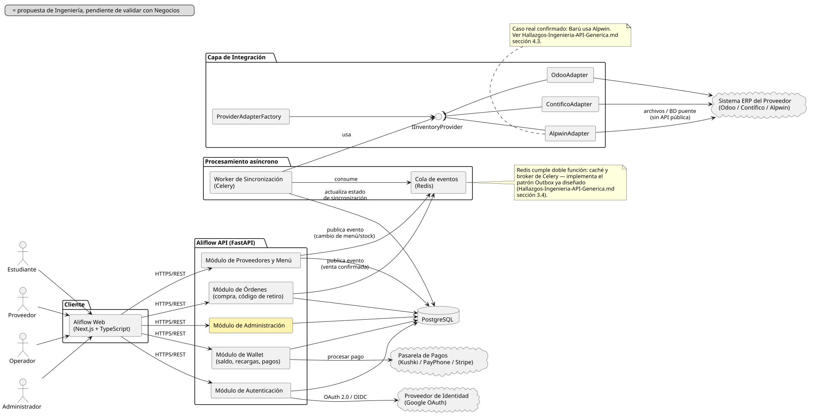

# Documentación del Diagrama de Componentes — Aliflow

**Diagrama fuente:** `diagrama-componentes.puml`.

Este diagrama incorpora, por primera vez en la documentación formal del proyecto, el **stack tecnológico** recuperado de investigación previa del equipo (conversación revisada el 26-jul-2026): Next.js en el cliente, FastAPI en el backend, PostgreSQL como base de datos, y Redis/Celery para procesamiento asíncrono. Hasta ahora esta información solo existía en una conversación externa — queda aquí formalizada como parte del diseño.

## Componentes principales

### Cliente
- **Aliflow Web (Next.js + TypeScript)** — única aplicación web que sirve a los 4 roles (Estudiante, Proveedor, Operador, Administrador), consumiendo la API vía HTTPS/REST. No hay apps nativas separadas por rol; la diferenciación de interfaz ocurre por rol de sesión, no por despliegue distinto.

### Aliflow API (FastAPI)
Organizada en módulos, cada uno mapeado a los paquetes del diagrama de clases:
- **Módulo de Autenticación** — implementa UC1 (OAuth institucional) y UC6 (login operativo); es el único módulo que habla con el **Proveedor de Identidad** externo.
- **Módulo de Wallet** — implementa UC2 (recarga); es el único módulo que habla con la **Pasarela de Pagos**.
- **Módulo de Órdenes** — implementa UC4/UC5 (compra, retiro); publica eventos a la cola cuando se confirma una venta.
- **Módulo de Proveedores y Menú** — implementa UC7/UC8 (integración, administración de menú).
- **Módulo de Administración** — implementa UC12/UC13/UC14 (los casos de uso propuestos para el rol Administrador, aún pendientes de validar con Negocios — ver `uml/Documentacion-Casos-de-Uso.md`).

Todos los módulos persisten en **PostgreSQL** directamente (no hay una capa de repositorio separada mostrada aquí — a ese nivel de detalle correspondería un diagrama de clases de infraestructura, fuera del alcance de "lógica de negocio" que pide la rúbrica).

### Capa de Integración
Es la traducción directa a componentes del patrón Adapter ya diseñado (`Hallazgos-Ingenieria-API-Generica.md` sección 3, `uml/diagrama-clases.puml`): la interfaz **IInventoryProvider** (notación de lollipop) es implementada por `OdooAdapter`, `ContificoAdapter` y `AlpwinAdapter`, y `ProviderAdapterFactory` decide cuál instanciar. Ningún otro componente del sistema depende de un adaptador concreto — solo de la interfaz.

### Procesamiento asíncrono
- **Cola de eventos (Redis)** — recibe eventos publicados por Órdenes y por Proveedores/Menú (venta confirmada, cambio de stock).
- **Worker de Sincronización (Celery)** — consume la cola, usa la Capa de Integración para notificar al ERP externo, y actualiza el estado de sincronización en la base de datos. Es la implementación concreta del patrón Outbox.

### Sistemas externos
- **Proveedor de Identidad (Google OAuth)** — ya documentado desde el flujo original (`est-1`).
- **Pasarela de Pagos (Kushki / PayPhone / Stripe)** — nueva incorporación formal; son las opciones que se manejaron en la investigación previa del equipo para el riesgo R-06 (`Gestion-de-Riesgos.md`) sobre limitaciones del ambiente de pruebas de pagos.
- **Sistema ERP del Proveedor** — en la práctica, Alpwin para Barú (sin API pública, integración por archivos/BD puente — ver nota en el diagrama y `Hallazgos-Ingenieria-API-Generica.md` sección 4.3).

## Decisiones de este diagrama que quedan abiertas

1. **Elección final de pasarela de pago** (Kushki vs. PayPhone vs. Stripe) — no se ha decidido, solo se documentan como candidatas evaluadas previamente.
2. **Redis con doble rol** (caché + broker de Celery) es una simplificación de infraestructura razonable para el alcance del proyecto universitario; en un entorno de producción más grande podría separarse en dos servicios.
3. El **Módulo de Administración** expone los casos de uso UC12-UC14 que Ingeniería propuso pero Negocios no ha validado — se incluye aquí por consistencia con el diagrama de clases, no porque su alcance esté cerrado.
