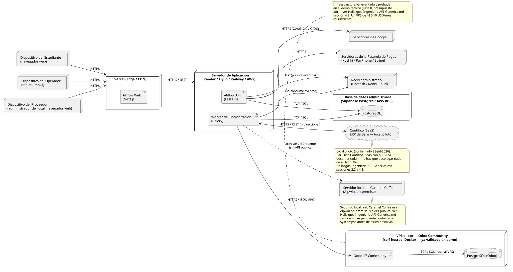

# Documentación del Diagrama de Despliegue — Aliflow

**Diagrama fuente:** `diagrama-despliegue.puml`.

Este diagrama traduce el diagrama de componentes (`uml/diagrama-componentes.puml`) a infraestructura física/de hosting concreta, combinando tres fuentes reales:

1. Las opciones de despliegue investigadas previamente por el equipo (Vercel, Render/Fly.io/Railway/AWS, Supabase/AWS RDS).
2. La infraestructura que **ya se levantó y probó** en el demo técnico con Odoo Community (`Hallazgos-Ingenieria-API-Generica.md` sección 4.2).
3. El hallazgo crítico de que el ERP real del proveedor (Barú) es Alpwin, on-premise, sin API pública (sección 4.3 del mismo documento).

## Nodos

| Nodo | Contenido | Notas |
|---|---|---|
| Dispositivos (Estudiante, Operador, Proveedor/Administrador) | Navegador web / tablet | Una sola aplicación web (no apps nativas separadas); el flujo ya documentaba que el Operador usa "interfaz simplificada... móvil o tablet" (`op-1`). |
| **Vercel (Edge/CDN)** | `Aliflow Web (Next.js)` | Hosting típico para Next.js — despliegue estático/edge con baja latencia. |
| **Servidor de Aplicación** (Render/Fly.io/Railway/AWS) | `Aliflow API (FastAPI)` + `Worker de Sincronización (Celery)` | Se muestran como dos artefactos en el mismo nodo lógico, aunque en producción normalmente correrían como dos servicios/procesos escalables por separado. |
| **Redis administrado** (Upstash/Redis Cloud) | — | Cache + broker de Celery (patrón Outbox). |
| **Base de datos administrada** (Supabase Postgres/AWS RDS) | `PostgreSQL` | Persistencia del dominio de Aliflow. |
| **VPS piloto — Odoo Community** | `Odoo 17 Community` + `PostgreSQL (Odoo)` | **Esta es la única infraestructura de este diagrama que ya existe y fue probada realmente** (`docker-compose.yml` en `demo-odoo/`) — no es una propuesta teórica. |
| **Servidor local de Barú** | Alpwin (on-premise) | Fuera del control de Aliflow — es la infraestructura del proveedor, no la nuestra. |
| Servidores de Google / Pasarela de Pagos | — | Terceros, fuera de nuestro control. |

## Flujos de comunicación relevantes

- **Estudiante/Operador/Proveedor → Vercel → API**: todo el tráfico de usuario pasa por HTTPS/REST, sin excepción.
- **API/Worker → PostgreSQL**: persistencia síncrona vía SQL.
- **API → Redis (publica) / Worker → Redis (consume)**: implementación real del patrón Outbox — la API nunca llama directamente al ERP externo, solo encola el evento.
- **Worker → Odoo (JSON-RPC)**: el mismo protocolo ya usado y depurado en el demo (recordar el hallazgo de que hubo que usar JSON-RPC en vez de XML-RPC por el problema de serializar `None`).
- **Worker → Alpwin (archivos/BD puente)**: línea punteada — a diferencia de la conexión con Odoo, esta vía **no está implementada ni confirmada todavía**; depende de lo que responda Syscompsa (pendiente en el checklist de `Hallazgos-Ingenieria-API-Generica.md`).

## Decisiones que quedan abiertas en este diagrama

1. **Proveedor de hosting final para la API** (Render vs. Fly.io vs. Railway vs. AWS) — no se ha decidido, solo se documentan como candidatas ya investigadas.
2. **Si el Worker corre como proceso separado o dentro del mismo contenedor que la API** — aquí se muestran como dos artefactos independientes (más correcto para escalar cada uno según su carga), pero es una decisión de implementación pendiente.
3. **La conexión real con Alpwin** — este diagrama asume la vía de archivos/BD puente como hipótesis de trabajo; podría cambiar completamente si Syscompsa ofrece algo distinto, o si se decide migrar a Barú a otro sistema (ver sección 4.3 del hallazgo de Ingeniería).
