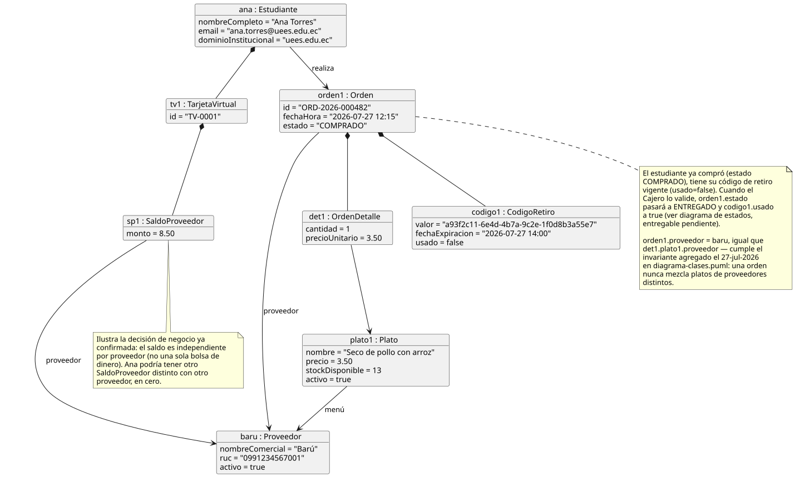
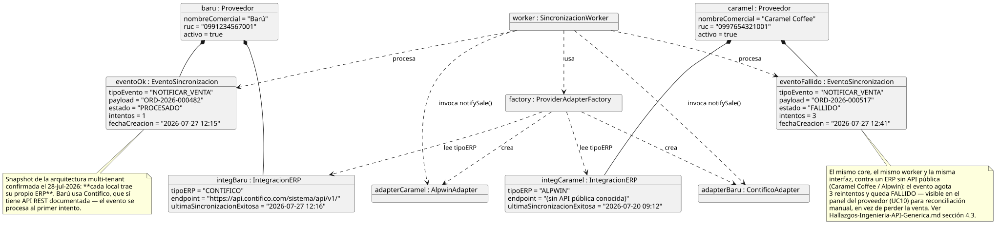

# Documentación de Diagramas de Objetos — Aliflow

Dos instantáneas (snapshots) de instancias concretas, cada una ilustrando un aspecto medular del diseño que el diagrama de clases (`diagrama-clases.puml`) por sí solo no deja tan claro.

---

## 1. Billetera y orden de un estudiante

**Fuente:** `objeto-billetera-orden.puml`

**Qué ilustra:** cómo funciona en concreto la decisión de Negocios del 28-jul-2026 sobre la recarga, que en el diagrama de clases solo se ve como una cardinalidad `1 -- 0..*`. Ana Torres (`Estudiante`) tiene una única `TarjetaVirtual` con **$8.50 en una bolsa común**, gastables en cualquier local — hizo una sola recarga, no una por proveedor. Los dos objetos `SaldoProveedor` colgando de esa tarjeta **no reparten** ese saldo: son el libro interno de lo que Aliflow ya le debe a cada local por compras hechas ($3.50 a Barú, $2.00 a Caramel Coffee). Esa es la lectura que Ingeniería le dio a "Aliflow distribuye internamente a todos los proveedores", y está marcada como interpretación pendiente de confirmar en `Decisiones-Pendientes-Negocios.md`.

La orden (`ORD-2026-000482`) está en estado `COMPRADO`, con su `CodigoRetiro` todavía sin usar — la instantánea representa el momento justo después de la compra y antes del retiro físico del almuerzo. Ese código (`418327`) refleja el otro cambio del 28-jul: **numérico corto de 6 dígitos**, no UUID.

## 2. Integración multi-tenant con los ERP de dos locales reales (Barú/Contífico y Caramel Coffee/Alpwin)

**Fuente:** `objeto-integracion-erp.puml`

**Qué ilustra:** la razón de ser de toda la capa de integración, ahora con los dos locales reales confirmados por Negocios el 28-jul-2026 conviviendo en el mismo snapshot:

- **Barú** tiene su `IntegracionERP` con `tipoERP = CONTIFICO`, un SaaS con API REST documentada. Su evento de venta se procesa **al primer intento** (`PROCESADO`).
- **Caramel Coffee** tiene `tipoERP = ALPWIN`, un sistema sin API pública conocida. Su evento **agota 3 reintentos y queda FALLIDO**.

La misma `ProviderAdapterFactory`, el mismo `SincronizacionWorker` y el mismo contrato `IInventoryProvider` sirven a los dos casos — que es exactamente lo que el patrón Adapter debía demostrar. Antes de la corrección de Negocios, este diagrama asumía que Barú usaba Alpwin y mostraba un único caso fallido; el escenario real es mejor de lo que creíamos (el local piloto es el fácil) y a la vez más exigente (hay que sostener varios ERP a la vez, no uno).

El evento fallido no es un caso de error hipotético: es exactamente el escenario que el patrón Outbox (`Hallazgos-Ingenieria-API-Generica.md` sección 3.4) fue diseñado para manejar sin perder la venta — queda visible para reconciliación manual (caso de uso UC10, `uml/Documentacion-Casos-de-Uso.md`) en vez de desaparecer silenciosamente.

---

*Ambos diagramas usan datos de ejemplo — no corresponden a transacciones reales.*
