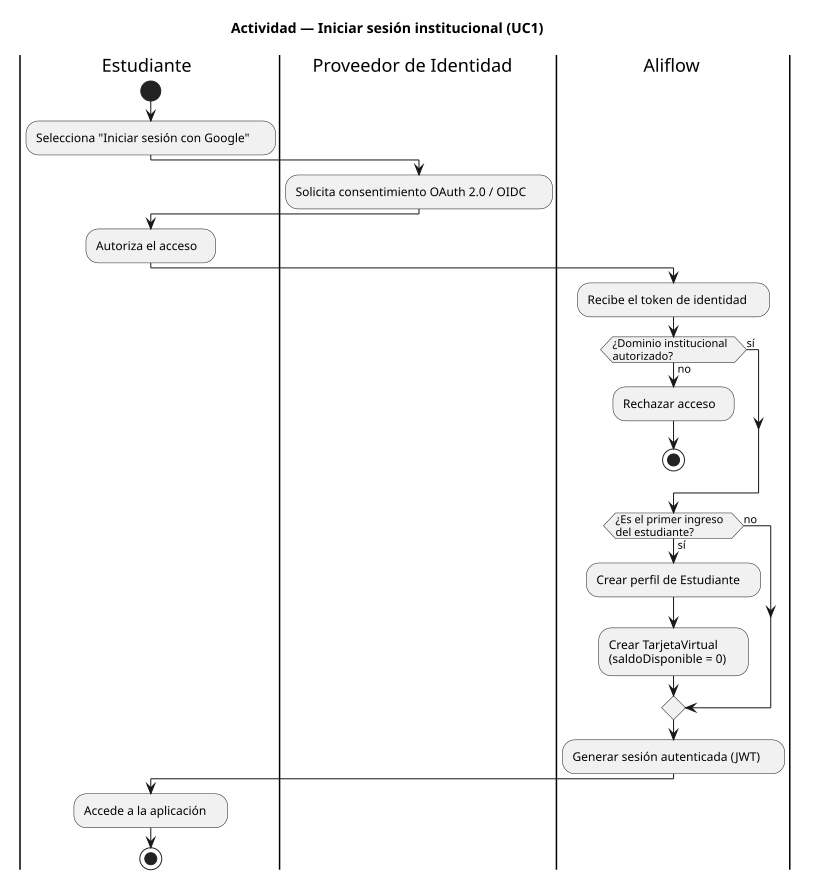
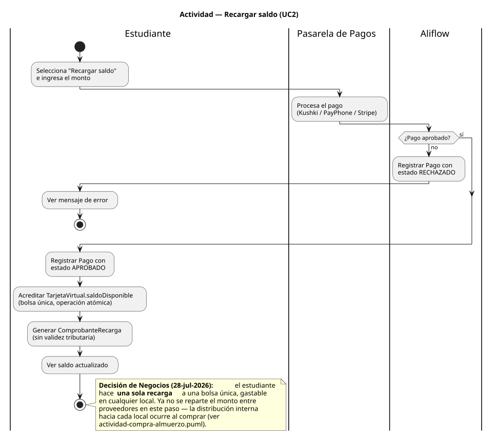
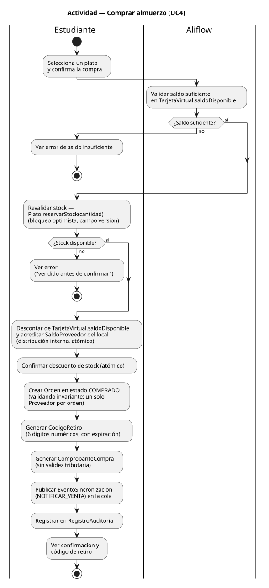
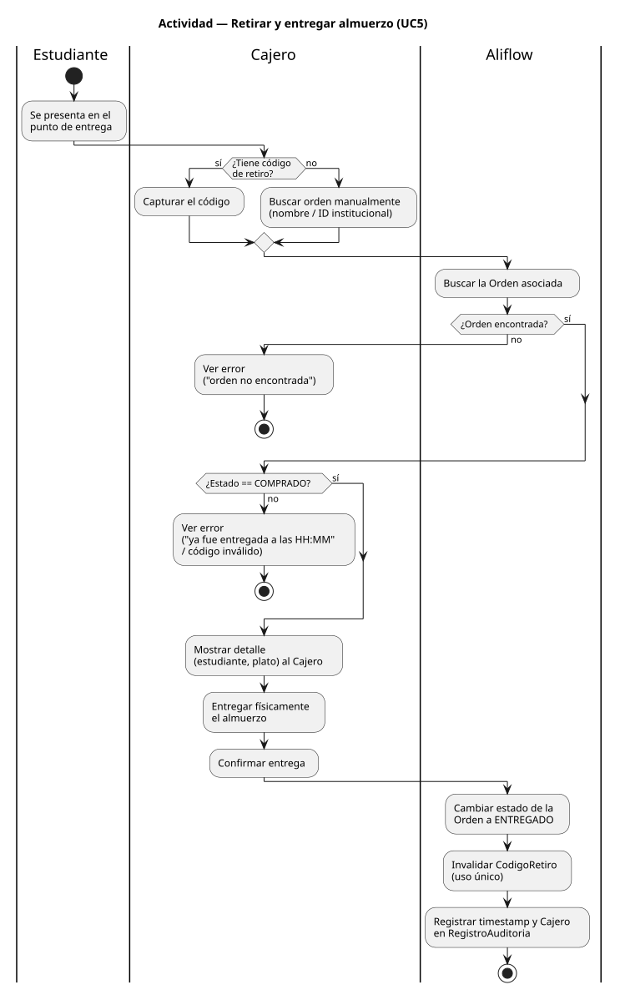
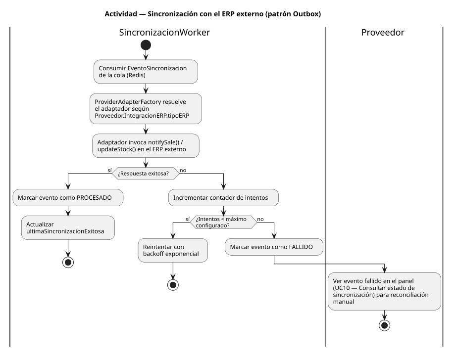

# Documentación de Diagramas de Actividad — Aliflow

Cinco diagramas de actividad, cubriendo los procesos del sistema con lógica de decisión real (ramas, excepciones, o relevancia transaccional). Cada uno usa carriles (swimlanes) por actor para dejar explícito quién hace qué.

---

## 1. Autenticación

**Fuente:** `actividad-autenticacion.puml` · **Referencia:** `est-1`, UC1.

Cubre la rama que el flujo original ya identificaba como crítica (validación de dominio institucional) y la rama de "primer ingreso" (creación de perfil y tarjeta virtual).

## 2. Recargar saldo

**Fuente:** `actividad-recarga-saldo.puml` · **Referencia:** `est-2`, UC2.

**Actualizado el 28-jul-2026** con la decisión de Negocios: la recarga es **única** y acredita una bolsa común (`TarjetaVirtual.saldoDisponible`), no se reparte entre proveedores en este paso. El reparto interno hacia cada local pasó al proceso de compra, donde sí se sabe a qué local le corresponde el dinero. Antes este paso mostraba una `EstrategiaDistribucionRecarga` marcada como propuesta pendiente.

## 3. Comprar almuerzo

**Fuente:** `actividad-compra-almuerzo.puml` · **Referencia:** `est-4`, UC4.

Es el proceso más crítico del sistema — incluye las dos validaciones que ya identificamos como riesgo (saldo insuficiente, stock agotado por concurrencia) y referencia explícitamente el mecanismo de corrección que agregamos en la revisión anterior: `Plato.reservarStock()` con bloqueo optimista (`version`), y el invariante de un solo proveedor por orden. También muestra que la orden se registra en `RegistroAuditoria`, cerrando el vacío que había detectado el riesgo R-09.

## 4. Retirar y entregar almuerzo

**Fuente:** `actividad-retiro-entrega.puml` · **Referencia:** `est-6`, `op-2` a `op-5`, UC5.

Cubre las tres ramas de excepción que el flujo original ya documentaba: sin código (búsqueda manual), orden no encontrada, y orden ya entregada/código inválido.

## 5. Sincronización con el ERP externo (patrón Outbox)

**Fuente:** `actividad-sincronizacion-erp.puml` · **Referencia:** `Hallazgos-Ingenieria-API-Generica.md` sección 3.4, `uml/objeto-integracion-erp.puml`.

Este es el proceso que materializa el patrón Outbox: consumir el evento, invocar el adaptador correspondiente, y — si falla — reintentar con backoff hasta un máximo, marcando el evento como `FALLIDO` para reconciliación manual en el panel del Proveedor (UC10). Es la misma secuencia que ya ilustramos con datos concretos en el diagrama de objetos (`objeto-integracion-erp.puml`, evento fallido tras 3 intentos contra Alpwin en Caramel Coffee, junto a uno exitoso contra Contífico en Barú) — aquí se ve el proceso general, allá el caso puntual.

---

## Procesos no cubiertos con diagrama de actividad propio (y por qué)

- **Consultar menú (UC3)** y **Administrar menú (UC8)** — son mayormente lineales (sin ramas de decisión relevantes más allá de la sincronización con el ERP, ya cubierta en el diagrama 5); no se justificaba un diagrama separado.
- **Configurar integración (UC7)**, **Consultar métricas (UC9/UC13)**, **Consultar estado de sincronización (UC10)**, **Consultar detalle de venta (UC11)** — son consultas/configuración sin lógica de negocio compleja.
- **UC12 (Gestionar usuarios del local)** — es un CRUD de cuentas sin ramas de decisión interesantes; no aporta como diagrama de actividad. Los antiguos UC13/UC14 desaparecieron junto con el rol de super-admin descartado por Negocios el 28-jul-2026.
