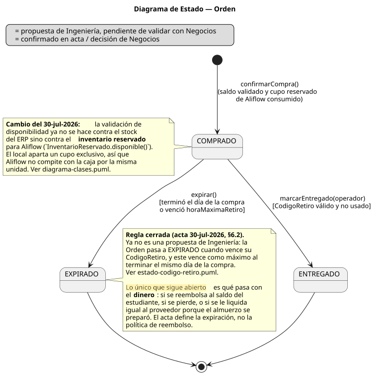
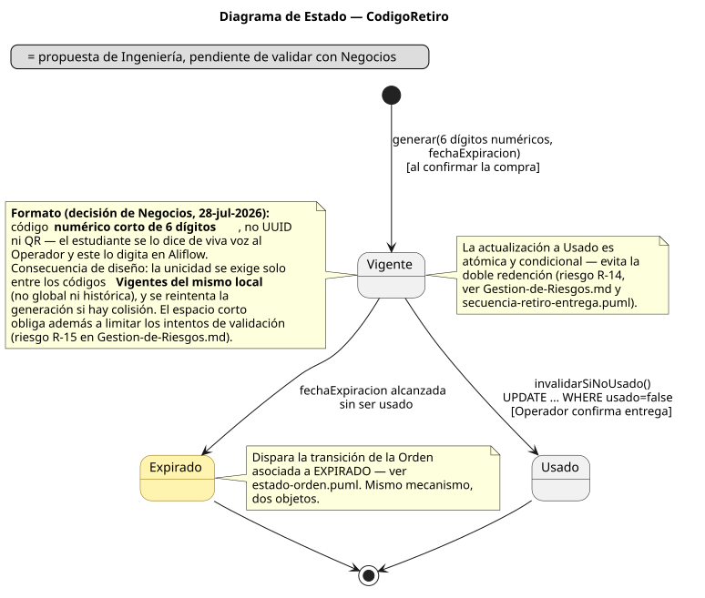
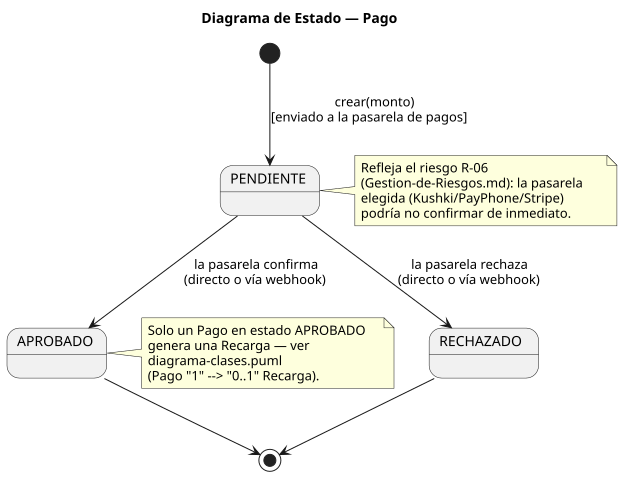
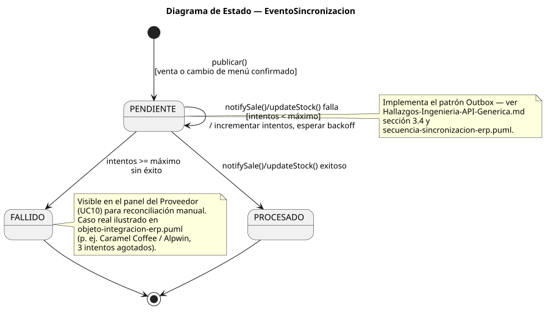
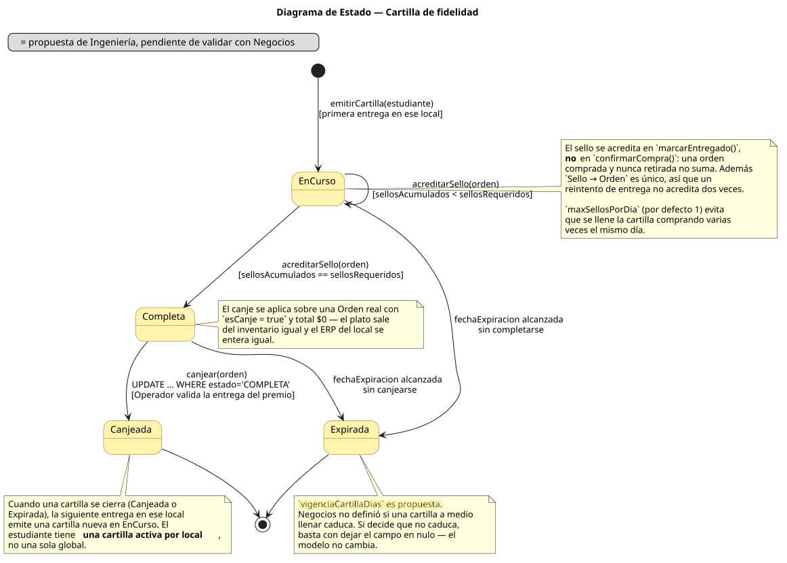

# Documentación de Diagramas de Estado — Aliflow

Cinco diagramas de estado, para los objetos del sistema con un ciclo de vida real (más de un estado posible y transiciones con condiciones). Misma convención visual que el resto del proyecto: fondo amarillo = propuesta de Ingeniería sin validar con Negocios.

---

## 1. Orden

**Fuente:** `estado-orden.puml` · **Referencia:** UC4/UC5, `uml/diagrama-clases.puml`.

`COMPRADO → ENTREGADO` es el camino confirmado del flujo original. `COMPRADO → EXPIRADO` ocurre cuando vence el `CodigoRetiro` asociado.

**Actualizado el 30-jul-2026 — dos cambios.** La regla de expiración **dejó de ser propuesta de Ingeniería**: el acta la define como *válido únicamente durante el día de la compra*. Y la condición de entrada a `COMPRADO` cambió: la disponibilidad ya no se valida contra el stock del ERP sino contra el **inventario reservado** para Aliflow (`InventarioReservado.disponible()`), porque el local aparta un cupo exclusivo y así Aliflow deja de competir con la caja por la misma unidad.

**Lo único que sigue abierto** es qué pasa con el **dinero** de una orden vencida: si se reembolsa, se pierde, o se le liquida al proveedor porque el almuerzo se preparó. El acta define la expiración, no la política de reembolso.

## 2. CodigoRetiro

**Fuente:** `estado-codigo-retiro.puml` · **Referencia:** UC5, `uml/secuencia-retiro-entrega.puml`.

**Actualizado el 30-jul-2026 — los tres estados quedaron definidos en acta.** Ya no son `Vigente / Usado / Expirado` como propuesta de Ingeniería, sino los tres estados oficiales que fija el acta (§6.3):

| Estado | Significado |
|---|---|
| **VÁLIDO** | El pedido está disponible para ser retirado |
| **UTILIZADO** | El Operador confirmó la entrega |
| **VENCIDO** | Terminó el horario de retiro o terminó el día de la compra |

`VÁLIDO → UTILIZADO` es la transición atómica y condicional (`UPDATE ... WHERE estado='VALIDO'`) que resuelve el riesgo R-14 (doble redención). `VÁLIDO → VENCIDO` dispara además la expiración de la `Orden` asociada — son dos objetos, pero una sola regla de negocio.

**La regla de vigencia, cerrada (acta §6.2):** el código vale **únicamente durante el día en que se hizo la compra**. `fechaExpiracion` se calcula como el mínimo entre la `horaMaximaRetiro` que configuró el local y el fin de ese día. Si se presenta otro día, debe mostrarse como vencido. Esto **cierra la decisión #5**, abierta desde el 27-jul.

**Un efecto colateral que conviene notar:** acotar la vigencia a un solo día reduce mucho el universo de códigos vigentes simultáneamente. Eso es justamente lo que hace viable exigir unicidad con solo 6 dígitos, y **refuerza la mitigación del riesgo R-15** sin que hubiera que hacer nada más.

**Formato del código, cerrado el 28-jul-2026:** Negocios eligió un **código numérico corto de 6 dígitos** en vez de la propuesta anterior (UUID firmado), porque el estudiante se lo dice de viva voz al Operador y este lo digita. El cambio no toca la máquina de estados, pero sí trae dos consecuencias de diseño que quedaron anotadas en el diagrama:

1. **Unicidad acotada, no global.** Seis dígitos son ~1 millón de combinaciones: alcanzan de sobra si la unicidad se exige solo entre los códigos **Vigentes de un mismo local**, pero no si se pretende que sean únicos históricamente. La generación reintenta ante colisión.
2. **Espacio de búsqueda pequeño.** Un código de 6 dígitos es adivinable por fuerza bruta de una forma que un UUID no lo era. Se registró como riesgo **R-15** (`../Entregables/01-Especificacion-de-Requerimientos/06-Gestion-de-Riesgos.md`), con la mitigación correspondiente.

## 3. Pago

**Fuente:** `estado-pago.puml` · **Referencia:** UC2, `uml/secuencia-recarga-saldo.puml`.

Simple pero real: `PENDIENTE` no es solo un estado transitorio instantáneo — puede persistir si la pasarela de pagos responde de forma asíncrona (riesgo R-06, `../Entregables/01-Especificacion-de-Requerimientos/06-Gestion-de-Riesgos.md`). Solo `APROBADO` genera una `Recarga`.

## 4. EventoSincronizacion

**Fuente:** `estado-evento-sincronizacion.puml` · **Referencia:** `Hallazgos-Ingenieria-API-Generica.md` sección 3.4.

El auto-loop en `PENDIENTE` (reintento con backoff) y la transición a `FALLIDO` tras agotar intentos son exactamente el comportamiento ya mostrado en el diagrama de secuencia y en el diagrama de objetos con el caso real de Alpwin en Caramel Coffee — este diagrama es la vista de ciclo de vida del mismo mecanismo.

## 5. Cartilla de fidelidad

**Fuente:** `estado-cartilla.puml` · **Referencia:** UC13/UC14/UC15, `uml/diagrama-clases.puml` paquete "Fidelidad".

**Requisito nuevo del 28-jul-2026**, todo en amarillo: la cartilla de fidelidad. Es el diagrama de estado que más aporta de los cinco, porque el ciclo de vida **es** la regla de negocio — cuándo suma un sello, cuándo se puede canjear y cuándo se pierde.

Cuatro estados: `EN_CURSO` (acumulando), `COMPLETA` (premio disponible), `CANJEADA` y `EXPIRADA`. Dos detalles que no son obvios y por eso están anotados en el propio diagrama:

- **El auto-loop en `EN_CURSO` se dispara desde `marcarEntregado()`, no desde `confirmarCompra()`.** Una orden comprada y nunca retirada no suma sello. Sin esta regla, la cartilla se puede llenar sin ir nunca a buscar el almuerzo, y el local termina regalando un premio por ventas que no ocurrieron físicamente.
- **`COMPLETA → CANJEADA` es atómica y condicional** (`UPDATE ... WHERE estado = 'COMPLETA'`), el mismo mecanismo que resuelve la doble redención del código de retiro (R-14). Sin esto, dos canjes simultáneos entregarían dos premios por una sola cartilla.

`EXPIRADA` es la parte más tentativa: Negocios no dijo si una cartilla a medio llenar caduca. Se modeló el estado con un campo `vigenciaCartillaDias` configurable; si la decisión es que no caduca, el campo queda nulo y la transición nunca se dispara — el modelo no cambia.

---

## Por qué estos 5 y no otros

`Estudiante`, `Proveedor`, `Plato` y `ProgramaFidelidad` no tienen un ciclo de vida con estados discretos más allá de `activo`/`inactivo` (una sola transición booleana, no justifica un diagrama). `SaldoProveedor` y `TarjetaVirtual` cambian de valor (monto) pero no de "estado" en el sentido UML. Se priorizaron los objetos cuyo estado determina qué operaciones son válidas en cada momento — que es exactamente el criterio que pide la rúbrica ("objetos pertinentes").
